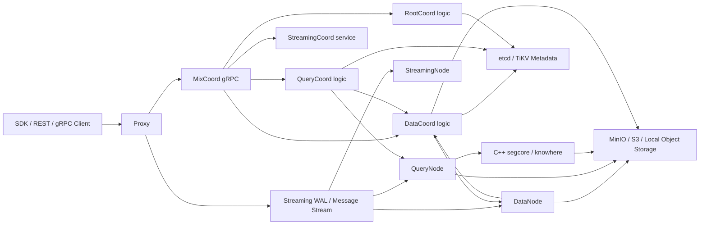
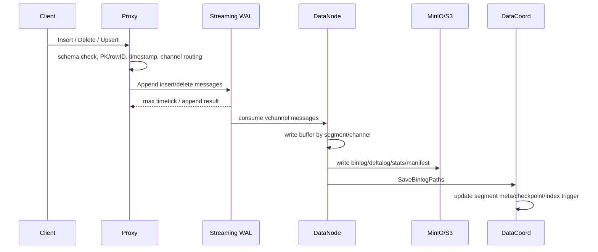
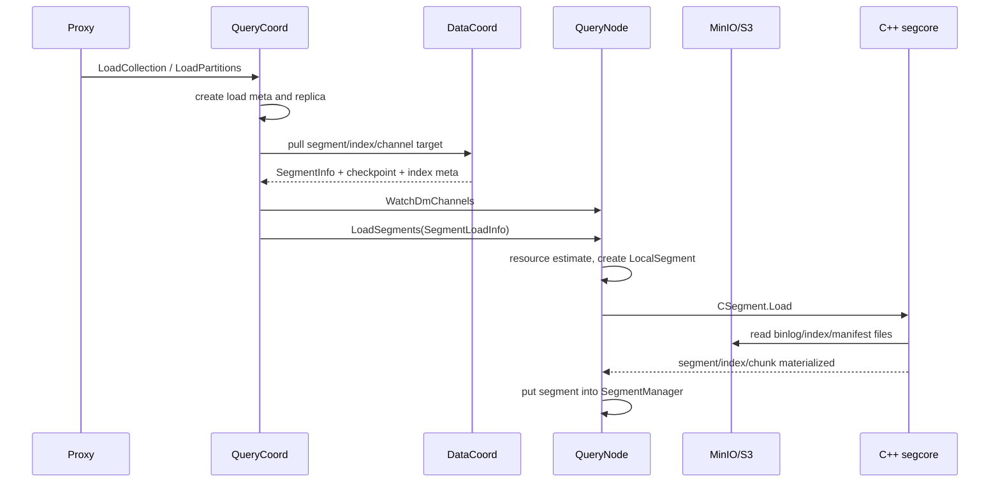
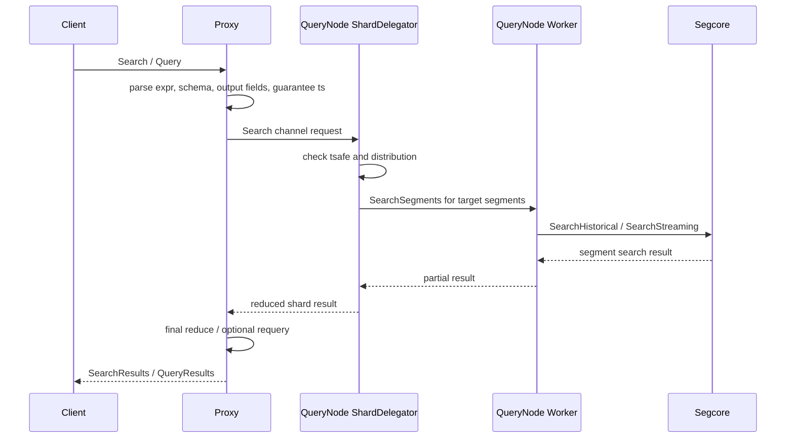
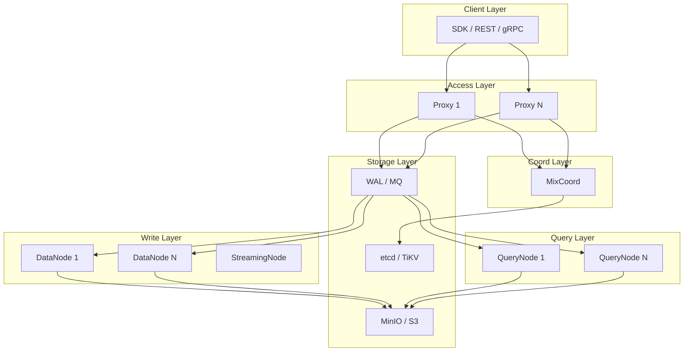
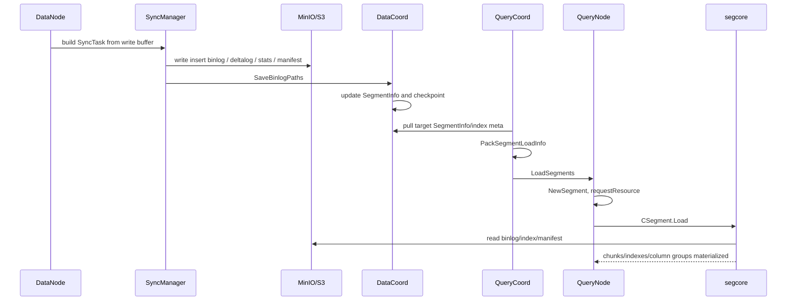

# Milvus 架构设计文档（4+1 视图）

本文基于当前 `D:\project\milvus` 源码梳理 Milvus 的分布式架构，重点覆盖读写主流程、组件边界、源码模块映射，以及 `DataNode -> MinIO/S3 -> QueryNode` 的数据加载链路。

## 1. 文档范围

### 1.1 目标

- 用 4+1 视图描述 Milvus 的整体架构。
- 从源码角度说明 Proxy、MixCoord、DataNode、QueryNode、StreamingNode、对象存储、元数据存储之间的职责边界。
- 说明写入、持久化、索引构建、加载、查询检索等关键链路。
- 为 QueryNode 从对象存储加载 segment/index 的 trace 分析提供架构上下文。

### 1.2 源码依据

主要参考路径：

- `cmd/roles/roles.go`
- `cmd/components`
- `internal/types/types.go`
- `internal/distributed`
- `internal/proxy`
- `internal/rootcoord`
- `internal/datacoord`
- `internal/datanode`
- `internal/flushcommon`
- `internal/querycoordv2`
- `internal/querynodev2`
- `internal/storage`
- `internal/storagev2`
- `internal/core/src/segcore`
- `internal/core/src/storage`
- `docs/developer_guides/chap01_system_overview.md`
- `docs/developer_guides/chap05_proxy.md`
- `docs/developer_guides/chap07_query_coordinator.md`
- `docs/developer_guides/chap08_binlog.md`
- `docs/developer_guides/chap09_data_coord.md`

### 1.3 当前源码中的重要事实

- `MixCoord` 在接口层聚合了 `RootCoordServer`、`QueryCoordServer`、`DataCoordServer`，逻辑职责仍分别落在 RootCoord、QueryCoord、DataCoord 模块。
- `DataNode` 同时实现 `datapb.DataNodeServer` 和 `workerpb.IndexNodeServer`，当前索引构建 worker 能力在 DataNode 内承载。
- `QueryNode` 的 sealed segment 加载由 Go 层调度，核心数据和索引物化进入 C++ segcore/knowhere。
- 对象存储通过 `storage.ChunkManager` 抽象，物理实现可以是 MinIO/S3/local 等。
- DML 当前经过 streaming WAL/message stream 追加，DataNode/QueryNode 消费对应 vchannel 数据。

## 2. 架构总览

Milvus 是面向向量检索的分布式数据库。整体架构按控制面、写入面、查询面、存储面拆分：

- 控制面：RootCoord、DataCoord、QueryCoord，通过 MixCoord 对外聚合协调接口。
- 写入面：Proxy 接收 DML，写入 WAL；DataNode 消费 WAL、维护 write buffer、flush 到对象存储。
- 查询面：Proxy 接收 DQL，基于 shard leader/distribution 路由到 QueryNode；QueryNode 维护 growing/sealed segment 并执行搜索。
- 存储面：etcd/TiKV 保存元数据，对象存储保存 binlog、deltalog、statslog、manifest、index file。
- 执行引擎：Go 层负责服务、调度和资源管理；C++ segcore/knowhere 负责 segment 内数据结构、索引、表达式过滤和向量检索。



## 3. 逻辑视图

逻辑视图描述系统中面向业务职责的主要组件。

### 3.1 Client 和 Proxy

Proxy 是 Milvus 的对外入口，实现 `milvuspb.MilvusServiceServer`，接收 DDL、DML、DQL 请求。

核心职责：

- 校验请求参数、collection/schema/partition 信息。
- 管理 meta cache，避免每次请求都访问 coord。
- 分配 rowID、timestamp，处理自动主键。
- 将 insert/delete/upsert 转换为内部消息并追加到 WAL。
- 将 search/query 组装为内部 DQL task，路由到 QueryNode 并归并结果。
- 将 create/load/index/flush 等控制类请求转发到 MixCoord。

源码位置：

- `internal/proxy/impl.go`
- `internal/proxy/task_insert.go`
- `internal/proxy/task_insert_streaming.go`
- `internal/proxy/task_search.go`
- `internal/proxy/task_query.go`

### 3.2 MixCoord 与三类 Coord

`internal/types/types.go` 中的 `MixCoord` 同时实现 RootCoord、QueryCoord、DataCoord 的 protobuf 服务接口。`internal/distributed/mixcoord/service.go` 在同一个 gRPC server 上注册：

- `rootcoordpb.RegisterRootCoordServer`
- `querypb.RegisterQueryCoordServer`
- `datapb.RegisterDataCoordServer`
- `RegisterStreamingCoordGRPCService`

逻辑职责如下。

| 逻辑组件 | 主要职责 | 典型源码 |
| --- | --- | --- |
| RootCoord | database/collection/partition/schema/alias/function/RBAC 元数据；ID/TSO；DDL 广播 | `internal/rootcoord` |
| DataCoord | segment 元数据、channel checkpoint、flush、compaction、index/analyze/stats 调度 | `internal/datacoord` |
| QueryCoord | load/release、replica、resource group、target/distribution、balance、QueryNode 任务调度 | `internal/querycoordv2` |
| StreamingCoord | WAL/channel 相关协调服务 | `internal/streamingcoord` |

### 3.3 Streaming WAL / Message Stream

WAL 是 DML 和 DDL 广播的顺序化入口。Proxy 将 insert/delete 等请求转换成消息写入对应 vchannel。DataNode、QueryNode、StreamingNode 根据角色消费对应流。

关键点：

- vchannel/pchannel 用于把 collection 的写入按 shard 分流。
- 每条消息带 timestamp，读路径用 guarantee timestamp / mvcc timestamp 控制可见性。
- DDL 通过 control channel 与 collection vchannel 广播，使不同组件按统一时间线更新元数据和 cache。

源码位置：

- `internal/distributed/streaming`
- `pkg/streaming`
- `pkg/mq`
- `internal/proxy/task_insert_streaming.go`
- `internal/rootcoord/ddl_callbacks_create_collection.go`

### 3.4 DataNode

DataNode 是写入执行节点，当前还承载 index worker 能力。

核心职责：

- 消费 WAL 中的 insert/delete。
- 按 collection/partition/channel/segment 维护 write buffer。
- 达到 flush policy 或收到 flush 后，将数据序列化为 binlog、deltalog、statslog、BM25 stats、Storage V2/V3 packed/manifest。
- 通过 `storage.ChunkManager` 写入 MinIO/S3/local。
- 通过 `SaveBinlogPaths` 向 DataCoord 提交 segment 的 binlog 路径、checkpoint、manifest path 和状态。
- 执行 DataCoord 下发的 index build/analyze/stats/import/compaction 任务。

源码位置：

- `internal/datanode`
- `internal/datanode/index`
- `internal/flushcommon/writebuffer`
- `internal/flushcommon/syncmgr`

### 3.5 QueryCoord

QueryCoord 是查询侧的控制面。

核心职责：

- 维护 collection/partition 的 load meta。
- 创建 replica 并绑定 resource group。
- 周期性从 DataCoord 拉取 target：应加载的 channel、sealed segment、L0 segment、stats、index 信息。
- 根据 target 和当前 QueryNode distribution 生成 grow/reduce/reopen/stats/delta 等任务。
- 将 `LoadSegmentsRequest`、`WatchDmChannelsRequest`、`ReleaseSegmentsRequest` 发送给 QueryNode。
- 处理 balance、failover、leader checker、index checker。

源码位置：

- `internal/querycoordv2/job`
- `internal/querycoordv2/checkers`
- `internal/querycoordv2/task`
- `internal/querycoordv2/meta`
- `internal/querycoordv2/session`

### 3.6 QueryNode

QueryNode 是查询执行节点。

核心职责：

- Watch DML channel，维护 growing segment 和 delete buffer。
- 加载 sealed segment 的 field data、stats、deltalog、index。
- 通过 ShardDelegator 作为 shard leader 管理本 shard 的搜索、查询、转发和归并。
- 将本地 search/query task 提交给 scheduler，调用 segcore 执行检索。
- 维护 collection/segment 引用计数、资源估算、local cache、mmap/tiered eviction 等。

源码位置：

- `internal/querynodev2/services.go`
- `internal/querynodev2/delegator`
- `internal/querynodev2/segments`
- `internal/querynodev2/tasks`
- `internal/core/src/segcore`
- `internal/core/src/storage`

### 3.7 存储和元数据

| 存储类型 | 作用 | 典型内容 |
| --- | --- | --- |
| etcd/TiKV | 元数据存储 | collection schema、segment meta、index meta、load meta、resource group、channel checkpoint |
| MinIO/S3/local | 对象存储 | insert binlog、delta log、stats log、BM25 stats、Storage V2/V3 manifest、index files |
| WAL/MQ | 有序消息流 | insert、delete、DDL broadcast、time tick |
| QueryNode local cache | 本地缓存 | mmap 文件、disk index、本地临时数据 |

## 4. 开发视图

开发视图描述源码模块如何组织。

### 4.1 进程与组件入口

| 源码路径 | 职责 |
| --- | --- |
| `cmd/milvus` | Milvus 主命令入口 |
| `cmd/roles/roles.go` | 根据角色配置启动 Proxy、MixCoord、QueryNode、DataNode、StreamingNode、CDC |
| `cmd/components` | 各组件的 `Prepare/Run/Stop` 封装 |
| `internal/distributed` | gRPC server/client 封装和服务注册 |
| `internal/types/types.go` | 组件接口定义和 client/server contract |

### 4.2 业务模块

| 模块 | 说明 |
| --- | --- |
| `internal/proxy` | API 接入层、任务队列、请求校验、路由和结果归并 |
| `internal/rootcoord` | DDL 元数据、schema、ID/TSO、DDL broadcast callback |
| `internal/datacoord` | segment/index/compaction/import/stats 元数据和调度 |
| `internal/datanode` | DML 消费、flush、index worker、compaction worker、import worker |
| `internal/querycoordv2` | 查询侧 load/release/balance/replica/target/distribution |
| `internal/querynodev2` | 查询执行、channel delegator、segment manager、load/search/query task |
| `internal/streamingnode` | streaming WAL node 和相关 client/handler |
| `internal/storage` | Go 层 binlog/serde/chunk manager/storage codec |
| `internal/storagev2` | packed storage、manifest、filesystem metrics、FFI |
| `internal/core/src` | C++ segcore、query、index、storage、knowhere 相关执行逻辑 |
| `pkg/proto` | Milvus 内部 protobuf 生成代码 |
| `pkg/util/paramtable` | 配置参数统一管理 |

### 4.3 关键接口契约

| 契约 | 用途 |
| --- | --- |
| `types.Component` | 所有服务组件统一的 `Init/Start/Stop/Register` 生命周期 |
| `types.MixCoordClient` | Proxy 和其他组件调用 Root/Data/Query Coord 聚合接口 |
| `datapb.SaveBinlogPathsRequest` | DataNode flush 后提交对象存储路径和 checkpoint 给 DataCoord |
| `datapb.SegmentInfo` | DataCoord 保存和返回的 segment 元数据 |
| `querypb.SegmentLoadInfo` | QueryCoord 下发给 QueryNode 的 segment 加载契约 |
| `querypb.LoadSegmentsRequest` | QueryCoord/ShardDelegator 触发 QueryNode 加载 sealed/L0/delta/stats/reopen |
| `querypb.WatchDmChannelsRequest` | QueryNode watch growing channel 的契约 |
| `workerpb.CreateJobRequest` | DataCoord 向 DataNode index worker 下发索引构建任务 |
| `storage.ChunkManager` | Go 层对象存储抽象 |
| segcore C API | Go QueryNode 调用 C++ segment load/search/query 的边界 |

### 4.4 `SegmentLoadInfo` 的核心字段

`SegmentLoadInfo` 是 DataCoord 元数据到 QueryNode 加载行为的关键桥梁。QueryCoord 在 `internal/querycoordv2/utils/types.go` 中通过 `PackSegmentLoadInfo` 组装：

- `SegmentID`、`CollectionID`、`PartitionID`
- `InsertChannel`
- `NumOfRows`
- `BinlogPaths`
- `Deltalogs`
- `Statslogs`
- `Bm25Logs`
- `TextStatsLogs`
- `JsonKeyStatsLogs`
- `IndexInfos`
- `StartPosition`
- `DeltaPosition`
- `Level`
- `StorageVersion`
- `ManifestPath`
- `ChildManifestPaths`
- `CommitTimestamp`
- `DataVersion`
- `IsSorted`

QueryNode 根据这些字段决定要加载哪些对象、是否走 manifest、是否加载 index、是否只加载 delta/stats，以及加载后的可见性边界。

## 5. 进程视图

进程视图描述运行时交互、并发和控制流。

### 5.1 启动生命周期

`cmd/roles/roles.go` 根据角色配置启动组件。每个组件遵循：

```text
creator -> Prepare -> Run -> Stop
```

启动时典型行为：

- 初始化参数、日志、metrics、trace。
- 初始化 dependency factory、etcd/TiKV client、storage factory。
- 启动 gRPC server 并注册对应 protobuf service。
- 注册健康检查。
- QueryNode 在非 posix mode 下启动时清理本地 cache path。

### 5.2 请求调度模型

Proxy 内部把不同请求分到不同队列：

- DD queue：CreateCollection、DropCollection、CreateIndex 等定义类请求。
- DML queue：Insert、Delete、Upsert。
- DQL queue：Search、Query。
- DC queue：Flush 等 DataCoord 类请求。

QueryNode 内部也有 task scheduler：

- `SearchTask`：本地 segment search 和 reduce。
- `QueryTask`：retrieve/query。
- load 操作由 QueryNode service 收到请求后同步进入 loader，并在 loader 内按资源估算并行处理 segment。

### 5.3 写入运行时



### 5.4 加载运行时



### 5.5 查询运行时



### 5.6 一致性和时间

Milvus 的读写可见性基于 timestamp：

- Proxy 给请求分配或解析 timestamp。
- WAL 消息携带 timestamp。
- DataNode flush 时提交 checkpoint。
- QueryNode 的 ShardDelegator 维护 tSafe/MVCC 进度。
- 查询请求的 guarantee timestamp 决定 QueryNode 是否必须等待数据追上。
- time travel 读通过 travel timestamp 选择历史可见快照。

## 6. 物理视图

物理视图描述部署拓扑和外部依赖。

### 6.1 分布式部署



### 6.2 扩缩容单元

| 组件 | 扩缩容维度 | 状态 |
| --- | --- | --- |
| Proxy | 请求入口吞吐、连接数、DQL/DML task 压力 | 近似无状态，依赖 meta cache |
| DataNode | WAL 消费、flush、index/compaction/import worker 能力 | 本地 buffer，核心状态在 DataCoord/object storage |
| QueryNode | 查询吞吐、segment 内存、index 内存、shard 负载 | 持有 loaded segment/index 和 channel delegator |
| MixCoord | 控制面吞吐、元数据调度 | 依赖 etcd/TiKV |
| StreamingNode/WAL | 写入吞吐、消息保留、channel 分配 | WAL 状态和消息持久化 |
| MinIO/S3 | 对象存储容量和带宽 | 持久化数据和索引 |
| etcd/TiKV | 元数据容量和事务能力 | 控制面元数据 |

### 6.3 部署依赖

Milvus 进程本身不把业务数据直接放在本地作为唯一持久化来源，核心持久化依赖包括：

- 元数据存储：etcd 或 TiKV。
- 对象存储：MinIO/S3/local。
- WAL/MQ：Streaming WAL、Pulsar、Kafka、Rocksmq、Woodpecker 等具体实现取决于配置和版本能力。
- metrics/tracing：Prometheus/OpenTelemetry 相关组件。

## 7. 场景视图（+1）

场景视图用关键用例串起前四个视图。

### 7.1 创建 Collection

```text
Client
  -> Proxy.CreateCollection
  -> createCollectionTask
  -> MixCoord.RootCoord.CreateCollection
  -> RootCoord validate schema / assign IDs / assign channels
  -> broadcast create collection to control channel and vchannels
  -> DDL callback writes collection meta and shard info
  -> expire Proxy meta cache
```

设计要点：

- RootCoord 负责 schema、field ID、partition、shard/channel、collection meta。
- DDL 通过 WAL broadcast 建立跨组件一致的时间线。
- 创建 vchannel 后，DataCoord/QueryCoord 后续可以基于 channel 管理写入和加载。

### 7.2 Insert 到持久化

```text
Client Insert
  -> Proxy.Insert
  -> insertTask.PreExecute
  -> insertTask.Execute
  -> streaming.WAL().AppendMessages
  -> DataNode consume
  -> writeBuffer
  -> SyncTask.Run
  -> ChunkManager.Write to MinIO/S3
  -> MetaWriter.UpdateSync
  -> DataCoord.SaveBinlogPaths
```

设计要点：

- Proxy 完成 schema 校验、rowID/PK/timestamp、partition/channel 路由。
- DataNode 按 segment 聚合内存数据，flush 时才生成持久对象。
- DataCoord 是 segment 元数据事实来源，QueryCoord 通过 DataCoord 获取后续加载目标。

### 7.3 Flush

```text
Client Flush
  -> Proxy.Flush
  -> DataCoord.Flush
  -> seal segment / get channel checkpoint
  -> DataNode flush write buffer
  -> SaveBinlogPaths
  -> DataCoord mark flushed and trigger index/compaction
```

设计要点：

- DataCoord 的 `Flush` 返回 seal/flush 信息，但对象真正写入由 DataNode 的 sync task 完成。
- `SaveBinlogPaths` 同时提交 binlog 路径、stats、delta、manifest、checkpoint。
- flushed segment 后续会进入 index build 和 QueryNode sealed load 链路。

### 7.4 创建索引

```text
Client CreateIndex
  -> Proxy.CreateIndex
  -> DataCoord.CreateIndex
  -> index meta and create-index broadcast
  -> DataCoord index scheduler
  -> DataNode workerpb.IndexNodeServer.CreateJob
  -> datanode/index.IndexBuildTask
  -> C++ index build / knowhere
  -> upload index files to object storage
  -> DataCoord stores index file meta
```

设计要点：

- 当前源码没有单独的 `internal/indexnode` 角色目录，index worker 由 DataNode 承载。
- 对大段数据，索引文件最终也在对象存储中，QueryNode 加载 segment 时通过 `FieldIndexInfo` 获取 index file 路径。

### 7.5 Load Collection / Segment

```text
Client LoadCollection
  -> Proxy.LoadCollection
  -> QueryCoord.LoadCollection
  -> LoadCollectionJob writes load meta and replicas
  -> TargetObserver pulls target from DataCoord
  -> Checker generates SegmentTask/ChannelTask
  -> packLoadSegmentRequest
  -> QueryNode.LoadSegments
  -> segmentLoader.Load
  -> segcore load field/index/manifest
```

设计要点：

- QueryCoord 不是直接加载文件，它负责生成应该在哪个 QueryNode 加载哪些 segment 的任务。
- `packLoadSegmentRequest` 设置 `LoadScope`，区分 full、delta、stats、reopen 等加载类型。
- QueryNode 通过 loader 做资源估算、并发控制、segment 去重、C++ segment 创建和加载。

### 7.6 Search / Query

```text
Client Search
  -> Proxy.Search
  -> searchTask.PreExecute
  -> route by shard leader cache
  -> QueryNode.Search
  -> ShardDelegator.Search
  -> QueryNode.SearchSegments
  -> tasks.SearchTask
  -> segments.SearchHistorical / SearchStreaming
  -> segcore
  -> partial reduce on QueryNode
  -> final reduce on Proxy
```

设计要点：

- Proxy 处理表达式、输出字段、consistency、partition key、hybrid search 等请求语义。
- QueryNode 的 ShardDelegator 管理 channel 级查询视图和分发。
- segcore 对 growing/sealed segment 执行过滤和向量检索。
- 查询结果可能触发 requery，用于补齐 output fields。

### 7.7 Delete 和可见性

```text
Client Delete
  -> Proxy.Delete
  -> WAL delete message
  -> QueryNode streaming pipeline updates delete buffer
  -> DataNode writes deltalog/L0 segment
  -> QueryNode load delta/L0
  -> search/query applies delete and timestamp visibility
```

设计要点：

- Delete 不是立即改写旧 segment，而是通过 delete log / L0 / delete buffer 在读路径过滤。
- compaction 后可能生成新 segment，旧 segment 被替换或标记不可见。

### 7.8 DataNode -> MinIO/S3 -> QueryNode 详细场景

这是本仓库当前 trace 改造最关注的链路。



关键数据流：

- DataNode 写入对象：binlog、deltalog、statslog、BM25 stats、Storage V2/V3 manifest、index build 输出。
- DataCoord 保存路径：`SegmentInfo.Binlogs`、`Deltalogs`、`Statslogs`、`ManifestPath`、index meta。
- QueryCoord 下发加载契约：`querypb.SegmentLoadInfo`。
- QueryNode 读对象并物化：field chunk、PK bloom filter、scalar/vector index、manifest column group。

## 8. 质量属性

### 8.1 可扩展性

- Proxy、DataNode、QueryNode 可水平扩展。
- collection shard/vchannel 将写入和查询按 channel 拆分。
- QueryCoord 使用 replica/resource group/balance 管理查询侧容量。
- DataCoord 将 index/compaction/import/stats 作为任务调度到 DataNode worker。

### 8.2 一致性

- 请求顺序基于 timestamp 和 WAL 顺序。
- batch insert/delete 对用户表现为原子可见。
- 查询通过 guarantee timestamp、mvcc timestamp、tSafe 等机制等待或选择可见快照。
- DDL 通过 broadcast 和 cache invalidation 保证各组件逐步收敛。

### 8.3 高可用与恢复

- 元数据持久化在 etcd/TiKV。
- 数据和索引持久化在对象存储。
- QueryNode 故障后，QueryCoord 可基于 target/distribution 重新调度 segment load。
- DataNode 写入失败会通过 sync task retry、meta 写入 retry 等机制处理。

### 8.4 性能

- 写入侧通过 WAL 和 write buffer 解耦前台请求与对象存储写入。
- 查询侧通过 sealed segment index、growing segment 增量视图、shard delegator 减少跨节点协调。
- QueryNode load 前做资源估算和并发控制，避免同时加载过多大 segment。
- Storage V2/V3 manifest/packed storage 支持更灵活的列组和数据组织。

### 8.5 可观测性

- 组件内大量使用 metrics、mlog、OpenTelemetry span。
- Proxy 记录慢查询、请求延迟、DML/DQL 计数。
- DataNode 记录 flush size、flush rows、index build latency。
- QueryNode 记录 load/search latency、资源消耗、segment distribution。
- 本仓库新增的 QueryNode load trace 文档和代码改造见：
  - `docs/developer_guides/milvus_querynode_load_trace_flow.md`
  - `docs/developer_guides/milvus_querynode_load_trace_code_changes.md`

## 9. 架构风险和演进点

| 风险/演进点 | 说明 |
| --- | --- |
| Coord 聚合与逻辑边界 | MixCoord 聚合服务接口，文档和排障时要区分进程边界与逻辑职责边界。 |
| Index worker 归属 | 当前由 DataNode 承载 index worker，旧资料中的独立 IndexNode 描述需要按当前源码修正。 |
| Storage V1/V2/V3 并存 | QueryNode load 和 DataNode flush 需要兼容不同存储版本，manifest 路径为空与非空会导致加载路径不同。 |
| QueryNode 内存/磁盘资源 | sealed segment/index 加载可能触发高峰内存和本地磁盘压力，需要依赖资源估算、mmap、tiered eviction 和 trace。 |
| WAL 与 flush 可见性 | WAL append、DataNode checkpoint、QueryNode tSafe 之间存在异步窗口，查询要通过 guarantee timestamp 等机制处理。 |
| compaction 替换链路 | compact-to descendant、L0/deltalog、manifest-backed delete source 会影响 QueryNode 加载和删除过滤。 |

## 10. 总结

Milvus 当前源码体现的是“控制面集中协调、数据面按 channel 分流、对象存储持久化、QueryNode 本地执行”的架构。写入链路把前台请求转化为 WAL 消息，再由 DataNode flush 到对象存储并提交 DataCoord 元数据；查询链路由 QueryCoord 根据 DataCoord 元数据调度 QueryNode 加载，QueryNode 再从对象存储拉取 segment/index 并在 segcore 中执行检索。

对 `DataNode -> MinIO/S3 -> QueryNode` 的分析，核心抓手是 `SaveBinlogPathsRequest`、`SegmentInfo`、`SegmentLoadInfo`、`LoadSegmentsRequest` 和 QueryNode segcore load 路径。这些契约把写入持久化结果、控制面调度和查询执行侧的内存物化串成完整链路。
