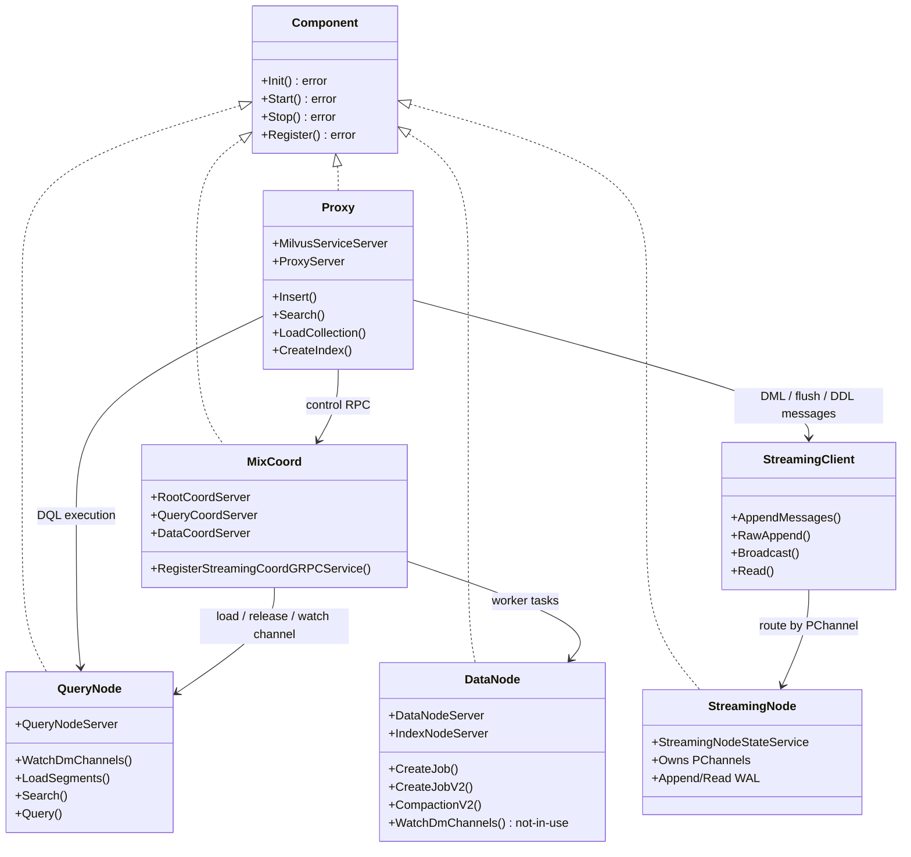
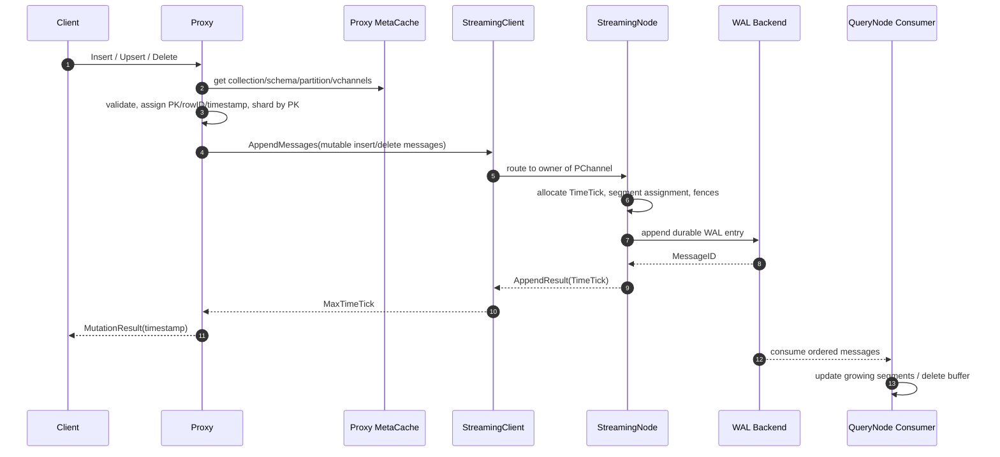
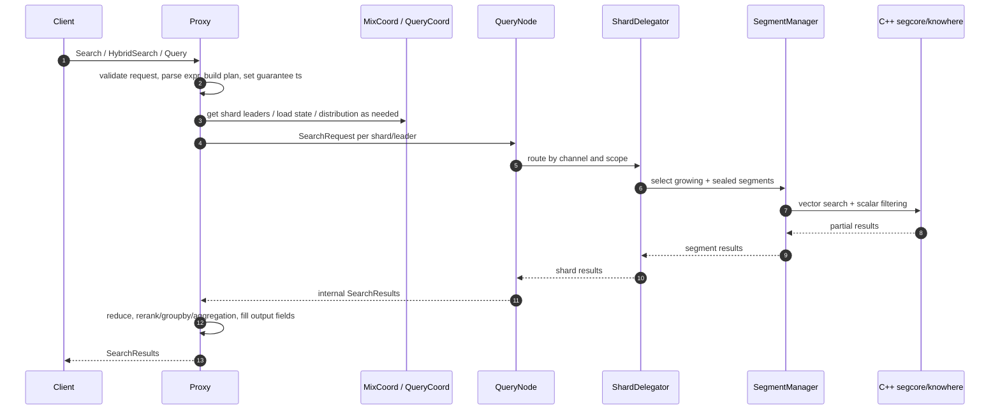
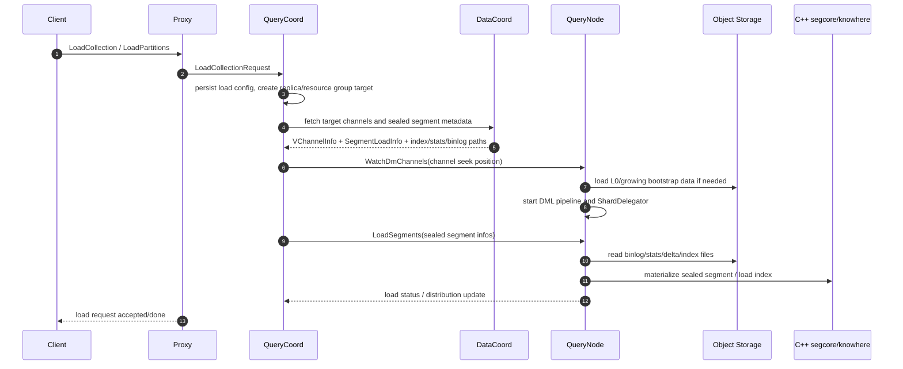
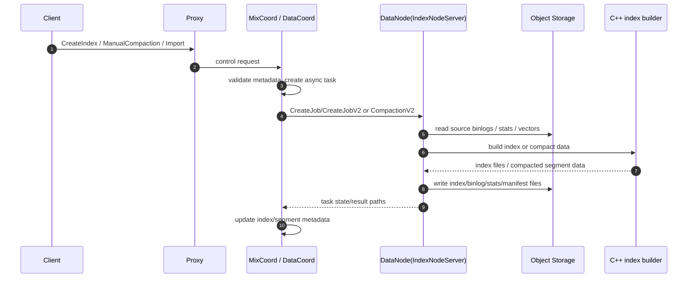
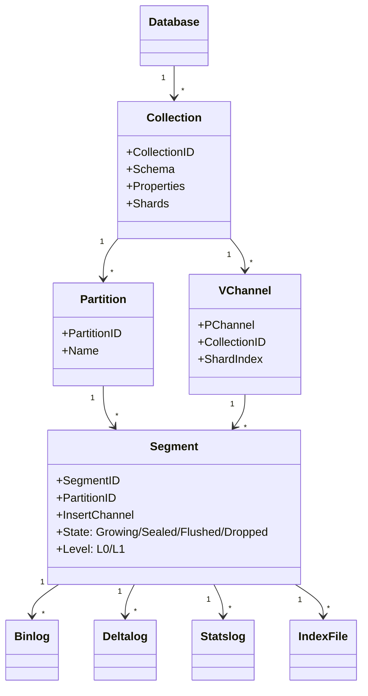

# Milvus Architecture UML Analysis

This document summarizes the architecture of the current source tree. It is
based on the local code and docs under `cmd/`, `internal/`, and
`docs/agent_guides/streaming-system/`.

## Key Conclusions

- `Proxy` is the external API gateway. It receives SDK/REST/gRPC requests,
  validates schema and parameters, allocates IDs/timestamps, routes DML to the
  WAL, routes DQL to `QueryNode`, and forwards control requests to `MixCoord`.
- `MixCoord` is the merged control-plane service. It registers RootCoord,
  QueryCoord, DataCoord, and StreamingCoord gRPC services in one process.
- `Streaming WAL` is the source of truth for mutations and metadata changes.
  PChannels are owned by `StreamingNode`; VChannels shard collections; CChannel
  serializes cluster-wide control messages.
- `QueryCoord` controls load/release/balance/replica/distribution and schedules
  `QueryNode` tasks.
- `QueryNode` executes search/query, maintains growing and sealed segments, and
  calls C++ `segcore/knowhere` for vector/scalar execution.
- `DataNode` currently implements both `DataNodeServer` and `IndexNodeServer`.
  Its `WatchDmChannels` RPC is marked "not in use" in this tree; index,
  compaction, import, stats, and related worker tasks are carried here.
- Metadata is stored in etcd/TiKV; persisted data and indexes are stored in
  object storage through `ChunkManager`.

## How To Read This Document

Read the diagrams in this order:

1. Component Architecture: understand which subsystems exist and who talks to
   whom.
2. Deployment UML: understand how those subsystems become processes/pods.
3. Component Interface Class Diagram: understand the main Go interfaces and
   RPC contracts.
4. Insert/Search/Load/Index sequence diagrams: understand the runtime request
   paths.
5. Data Model and State: understand how database objects map to channels,
   segments, logs, and index files.

The most important architectural split is:

- `Proxy` is the request entrance.
- `MixCoord` is the control-plane entrance.
- `StreamingNode + WAL backend` is the ordered write log.
- `QueryNode + segcore` is the read execution path.
- `DataNode` carries async worker jobs such as index, compaction, import, and
  stats.
- `etcd/TiKV` stores metadata; `MinIO/S3/local` stores persistent data files.

## 1. Component Architecture

```mermaid
flowchart LR
    Client[SDK / REST / gRPC Client] --> Proxy[Proxy]

    subgraph ControlPlane[Control Plane]
        MixCoord[MixCoord gRPC service]
        RootCoord[RootCoord logic\nDDL / schema / ID / TSO / RBAC]
        DataCoord[DataCoord logic\nsegment / flush / index / compaction meta]
        QueryCoord[QueryCoord v2 logic\nload / release / replica / balance]
        StreamingCoord[StreamingCoord\nPChannel assignment / DDL broadcast]
        MixCoord --> RootCoord
        MixCoord --> DataCoord
        MixCoord --> QueryCoord
        MixCoord --> StreamingCoord
    end

    subgraph WALPlane[Streaming WAL Plane]
        StreamingClient[StreamingClient\nstreaming.WAL()]
        StreamingNode[StreamingNode\nowns PChannels]
        WALBackend[WAL Backend\nKafka / Pulsar / Woodpecker / RMQ]
        StreamingClient --> StreamingNode
        StreamingNode --> WALBackend
    end

    subgraph WriteWorkers[Async Worker Plane]
        DataNode[DataNode\nDataNodeServer + IndexNodeServer]
        IndexWorker[Index / Analyze / Stats worker]
        CompactionWorker[Compaction / Import worker]
        DataNode --> IndexWorker
        DataNode --> CompactionWorker
    end

    subgraph QueryPlane[Query Plane]
        QueryNode[QueryNode v2]
        ShardDelegator[ShardDelegator\nleader / forward / reduce]
        SegmentManager[Segment Manager\ngrowing + sealed]
        Segcore[C++ segcore / knowhere]
        QueryNode --> ShardDelegator
        QueryNode --> SegmentManager
        SegmentManager --> Segcore
    end

    subgraph StoragePlane[Storage Plane]
        MetaStore[(etcd / TiKV)]
        ObjectStorage[(MinIO / S3 / local)]
    end

    Proxy --> MixCoord
    Proxy --> StreamingClient
    Proxy --> QueryNode

    StreamingCoord --> StreamingNode
    QueryCoord --> QueryNode
    QueryCoord --> DataCoord
    DataCoord --> DataNode

    RootCoord --> MetaStore
    DataCoord --> MetaStore
    QueryCoord --> MetaStore
    StreamingCoord --> MetaStore

    DataNode --> ObjectStorage
    QueryNode --> ObjectStorage
```

### 1.1 Component Architecture Explanation

This diagram answers: "When a user sends a request to Milvus, which major
subsystems can be involved?"

The nodes mean:

- `Client`: SDK, REST, or gRPC caller. It does not talk directly to storage,
  QueryNode, or coord services.
- `Proxy`: public gateway. It handles API-level validation, schema lookup,
  timestamp/ID assignment, request rewriting, routing, and result reduction.
- `Control Plane`: components that decide metadata, load state, task scheduling,
  and channel ownership. They do not execute vector search directly.
- `MixCoord`: the process-level wrapper for the control plane. In this source
  tree it registers RootCoord, DataCoord, QueryCoord, and StreamingCoord gRPC
  services.
- `RootCoord`: owns database/collection/partition/schema/function/RBAC metadata
  and allocates global IDs/timestamps.
- `DataCoord`: owns segment metadata, flush metadata, index metadata,
  compaction/import/stats task metadata, and the target data view used by
  QueryCoord.
- `QueryCoord`: owns loaded collection state, replicas, resource groups,
  target/distribution, and load/release/balance scheduling.
- `StreamingCoord`: owns PChannel assignment and DDL/DCL broadcast coordination.
- `StreamingClient`: in-process library used by Proxy and other components to
  append/read/broadcast WAL messages.
- `StreamingNode`: runtime owner of PChannels. It serializes append operations,
  assigns TimeTick, manages transactions/locks, and persists to the WAL backend.
- `WAL Backend`: durable log implementation. Current docs list Kafka, Pulsar,
  Woodpecker, and RocksMQ.
- `DataNode`: async worker process. It implements both `DataNodeServer` and
  `IndexNodeServer` in `internal/types/types.go`.
- `IndexWorker`: builds vector/scalar indexes, analyze tasks, and stats tasks.
- `CompactionWorker`: executes compaction/import/copy-style data jobs.
- `QueryNode`: read execution process. It owns loaded segments, DML pipelines,
  shard delegators, and calls C++ execution code.
- `ShardDelegator`: per-shard leader-side router/reducer. It decides whether a
  query is local, forwarded, or reduced across workers.
- `SegmentManager`: holds growing and sealed segments in the QueryNode process.
- `segcore/knowhere`: C++ execution engine for segment materialization, scalar
  filtering, vector index search, and brute-force vector search.
- `MetaStore`: etcd or TiKV metadata store.
- `ObjectStorage`: persistent file store, usually MinIO/S3 in deployment, local
  storage in some development/embedded modes.

The arrows mean:

- `Client -> Proxy`: all public user requests enter through Proxy.
- `Proxy -> MixCoord`: DDL, load/release, create index, flush, import, and
  metadata operations are forwarded to the control plane.
- `Proxy -> StreamingClient`: insert/delete/flush and some control messages are
  encoded as WAL messages.
- `Proxy -> QueryNode`: search/query execution is sent to shard leaders or
  selected QueryNodes after Proxy builds internal requests.
- `StreamingCoord -> StreamingNode`: assigns PChannels to StreamingNodes and
  publishes ownership.
- `QueryCoord -> QueryNode`: sends `WatchDmChannels`, `LoadSegments`,
  `ReleaseSegments`, and related scheduling operations.
- `QueryCoord -> DataCoord`: reads target segment/channel metadata to know what
  QueryNode should load.
- `DataCoord -> DataNode`: schedules index, compaction, import, analyze, and
  stats jobs.
- `RootCoord/DataCoord/QueryCoord/StreamingCoord -> MetaStore`: persist metadata
  and recover state across restarts.
- `DataNode/QueryNode -> ObjectStorage`: DataNode writes generated data/index
  files; QueryNode reads them when loading sealed/L0/stats/index data.

The important non-obvious point is that this tree is no longer accurately
described by the old "Proxy -> MQ -> DataNode and QueryNode consume DML" picture.
`DataNode.WatchDmChannels` is marked "not in use"; the current mutation source
of truth is the Streaming WAL path, while DataNode is still very important as an
async worker.

## 2. Deployment UML

```mermaid
deploymentDiagram
    node "Milvus Cluster" {
        node "Proxy Pods" {
            artifact "Proxy"
        }
        node "MixCoord Pod" {
            artifact "RootCoord service"
            artifact "DataCoord service"
            artifact "QueryCoord service"
            artifact "StreamingCoord service"
        }
        node "StreamingNode Pods" {
            artifact "PChannel WAL owners"
        }
        node "QueryNode Pods" {
            artifact "Query execution"
            artifact "segcore/knowhere"
        }
        node "DataNode Pods" {
            artifact "IndexNodeServer"
            artifact "Compaction/Import/Stats workers"
        }
    }

    database "Metadata Store\netcd or TiKV" as Meta
    database "Object Storage\nMinIO/S3/local" as Obj
    queue "WAL Backend\nKafka/Pulsar/Woodpecker/RMQ" as Wal

    "Proxy Pods" --> "MixCoord Pod" : gRPC
    "Proxy Pods" --> "StreamingNode Pods" : StreamingClient
    "Proxy Pods" --> "QueryNode Pods" : search/query gRPC
    "MixCoord Pod" --> "QueryNode Pods" : load/release/watch
    "MixCoord Pod" --> "DataNode Pods" : index/compaction/import tasks
    "StreamingNode Pods" --> Wal
    "MixCoord Pod" --> Meta
    "QueryNode Pods" --> Obj
    "DataNode Pods" --> Obj
```

### 2.1 Deployment Explanation

This diagram answers: "What runs as a process or pod in a cluster?"

In cluster mode:

1. `Proxy Pods` expose public Milvus API. They can scale horizontally because
   they are mostly stateless, using metadata caches and control-plane clients.
2. `MixCoord Pod` is the merged control-plane process. The code path is
   `internal/distributed/mixcoord/service.go`, where it registers RootCoord,
   QueryCoord, DataCoord, and StreamingCoord services on one gRPC server.
3. `StreamingNode Pods` own PChannels. A PChannel is assigned to one
   StreamingNode at a time. If a node fails, StreamingCoord can mark the channel
   unavailable and reassign it with a new term.
4. `QueryNode Pods` execute search/query. They hold loaded segments and call
   C++ `segcore/knowhere`.
5. `DataNode Pods` execute background worker jobs. In this tree they also expose
   `IndexNodeServer`, so index build requests are served by DataNode.
6. `Metadata Store` is external state. It stores collection metadata, segment
   metadata, load metadata, channel metadata, task metadata, and WAL coordination
   metadata.
7. `Object Storage` is durable data state. It stores binlogs, deltalogs,
   statslogs, index files, manifests, and packed storage files.
8. `WAL Backend` is durable ordered message state. It stores PChannel logs.

Standalone mode collapses many roles into one process, but the logical
boundaries are still similar. The main difference is that local dependencies
such as embedded etcd/RocksMQ can be enabled, and the network boundary is
smaller.

## 3. Component Interface Class Diagram



### 3.1 Interface Explanation

This diagram answers: "Which Go interfaces define the runtime contracts?"

Core interface:

- `Component` is the shared lifecycle contract. Every server component has
  `Init`, `Start`, `Stop`, and `Register`.

`Proxy`:

- Implements `milvuspb.MilvusServiceServer`, which is the public API surface:
  create/drop collection, insert, search, query, load, create index, flush, and
  so on.
- Implements `proxypb.ProxyServer`, used for internal operations such as
  invalidating metadata caches.
- Calls `MixCoord` for control-plane actions.
- Calls `StreamingClient` for WAL append/broadcast paths.
- Calls `QueryNode` for search/query execution.

`MixCoord`:

- Implements `rootcoordpb.RootCoordServer`.
- Implements `querypb.QueryCoordServer`.
- Implements `datapb.DataCoordServer`.
- Registers `StreamingCoord` gRPC service through
  `RegisterStreamingCoordGRPCService`.
- This means callers can treat one process as the gateway to several logical
  coordinator services.

`QueryNode`:

- Implements `querypb.QueryNodeServer`.
- `WatchDmChannels` starts channel consumption and creates the
  `ShardDelegator`.
- `LoadSegments` loads sealed/L0/stats/index data from object storage.
- `Search` and `Query` execute DQL requests.

`DataNode`:

- Implements `datapb.DataNodeServer`.
- Implements `workerpb.IndexNodeServer`.
- `CreateJob` and `CreateJobV2` are worker entry points for index/analyze/stats
  style jobs.
- `CompactionV2` executes compaction jobs.
- `WatchDmChannels` exists for compatibility but is marked "not in use" in
  `internal/datanode/services.go`.

`StreamingClient` and `StreamingNode`:

- `StreamingClient` is not a remote service interface. It is a client library
  accessed through `streaming.WAL()`.
- It discovers the StreamingNode that owns the target PChannel and appends or
  reads there.
- `StreamingNode` owns WAL instances for assigned PChannels and persists
  messages to the selected WAL backend.

## 4. Insert Flow



### 4.1 Insert Flow Step-by-Step

This diagram answers: "What happens after a client inserts rows?"

1. `Client -> Proxy`: the client sends `Insert`, `Upsert`, or `Delete`.
   Proxy is the only public entry point.
2. `Proxy -> Proxy MetaCache`: Proxy resolves database, collection, schema,
   partition, collection ID, partition ID, and VChannels. This avoids asking
   RootCoord/DataCoord for every small request.
3. `Proxy -> Proxy`: Proxy validates the request against the schema, fills
   system fields, allocates primary keys when `autoID` is enabled, assigns row
   IDs/timestamps, and shards rows by primary key or partition key.
4. `Proxy -> StreamingClient`: Proxy repacks user rows into internal mutable
   insert/delete messages and calls `streaming.WAL().AppendMessages(...)`. The
   relevant code is `internal/proxy/task_insert_streaming.go`.
5. `StreamingClient -> StreamingNode`: StreamingClient parses the VChannel to
   find the PChannel, discovers which StreamingNode owns that PChannel, and
   sends the append there.
6. `StreamingNode -> StreamingNode`: StreamingNode allocates TimeTick, applies
   channel locks/transactions/schema gates, assigns segment-related metadata,
   and protects against stale channel ownership.
7. `StreamingNode -> WAL Backend`: the message is durably appended to Kafka,
   Pulsar, Woodpecker, or RocksMQ depending on configuration.
8. `WAL Backend -> StreamingNode`: backend returns a backend-specific
   `MessageID`.
9. `StreamingNode -> StreamingClient`: append result includes TimeTick and
   append status.
10. `StreamingClient -> Proxy`: Proxy receives append results and computes
    `MaxTimeTick`.
11. `Proxy -> Client`: Proxy returns `MutationResult`. The timestamp is
    important for session consistency and visibility.
12. `WAL Backend -> QueryNode Consumer`: Query-side consumers read ordered WAL
    messages from their watched channels.
13. `QueryNode Consumer -> QueryNode Consumer`: QueryNode updates growing
    segments and delete buffers so fresh data becomes searchable after the
    required guarantee timestamp is satisfied.

The key idea: insert is acknowledged after WAL append, not after every later
read-side structure has been fully updated. Read freshness is enforced later by
timestamp and channel progress.

## 5. Search Flow



### 5.1 Search Flow Step-by-Step

This diagram answers: "How does a search request find data across QueryNodes?"

1. `Client -> Proxy`: the client sends `Search`, `HybridSearch`, or `Query`.
2. `Proxy -> Proxy`: Proxy validates collection/partition/field names, resolves
   schema, parses scalar expressions, builds the internal plan, prepares
   placeholders, computes output fields, and sets travel/guarantee timestamps.
3. `Proxy -> MixCoord / QueryCoord`: Proxy may ask for load state, shard leader
   mapping, or distribution information. QueryCoord is the authority for which
   QueryNode owns or leads which shard.
4. `Proxy -> QueryNode`: Proxy sends one internal request per shard or selected
   shard leader. This is where the read path leaves Proxy and enters execution.
5. `QueryNode -> ShardDelegator`: QueryNode finds the delegator for the channel.
   The delegator knows whether the current node is leader, what local segments
   exist, and whether some work must be forwarded.
6. `ShardDelegator -> SegmentManager`: the delegator selects target segments.
   This can include growing segments from streaming data and sealed segments
   loaded from object storage.
7. `SegmentManager -> C++ segcore/knowhere`: Go code calls into C++ execution
   for scalar filtering, vector search, index search, and segment-level result
   generation.
8. `C++ segcore/knowhere -> SegmentManager`: C++ returns partial results per
   segment.
9. `SegmentManager -> ShardDelegator`: segment results are collected at the
   shard level.
10. `ShardDelegator -> QueryNode`: shard-level result is returned to QueryNode.
11. `QueryNode -> Proxy`: QueryNode returns internal search results.
12. `Proxy -> Proxy`: Proxy reduces results from multiple shards/QueryNodes,
    applies topK merging, hybrid search reduction, group-by/aggregation/rerank
    logic, and fills requested output fields.
13. `Proxy -> Client`: final user-facing `SearchResults` are returned.

The key idea: QueryCoord does not execute search. It controls load and routing
metadata. Actual search execution is QueryNode plus C++ segcore/knowhere.

## 6. Load Collection / Segment Flow



### 6.1 Load Flow Step-by-Step

This diagram answers: "How does Milvus make a collection searchable?"

1. `Client -> Proxy`: the client calls `LoadCollection` or `LoadPartitions`.
2. `Proxy -> QueryCoord`: Proxy converts the public request into
   `querypb.LoadCollectionRequest` or `querypb.LoadPartitionsRequest`. In code,
   see `internal/proxy/task.go`.
3. `QueryCoord -> QueryCoord`: QueryCoord persists or updates load config,
   chooses replica count/resource groups, creates target state, and starts
   scheduling work.
4. `QueryCoord -> DataCoord`: QueryCoord asks DataCoord for the target view:
   channels to watch, sealed segments to load, row counts, binlog paths,
   deltalog paths, statslog paths, index files, and storage version details.
5. `DataCoord -> QueryCoord`: DataCoord returns `VChannelInfo` and
   `SegmentLoadInfo`-style data. This is the bridge from persisted data
   metadata to query-side loading.
6. `QueryCoord -> QueryNode`: QueryCoord sends `WatchDmChannels` so QueryNode
   starts consuming the DML channel from a checkpoint/seek position.
7. `QueryNode -> Object Storage`: QueryNode may load L0 delete segments,
   growing bootstrap data, or related logs required to initialize the shard
   state.
8. `QueryNode -> QueryNode`: QueryNode starts the DML pipeline and
   `ShardDelegator`. From this point the QueryNode can keep up with streaming
   changes for that shard.
9. `QueryCoord -> QueryNode`: QueryCoord sends `LoadSegments` for sealed
   historical segments.
10. `QueryNode -> Object Storage`: QueryNode reads binlogs, statslogs,
    deltalogs, manifests, and index files.
11. `QueryNode -> C++ segcore/knowhere`: QueryNode materializes sealed segments
    and loads vector/scalar index data into the execution engine.
12. `QueryNode -> QueryCoord`: QueryNode reports load completion/distribution
    state. QueryCoord uses this to decide whether the collection is sufficiently
    loaded.
13. `Proxy -> Client`: depending on API behavior and state, the client receives
    load completion or accepted/done status.

The key idea: loading has two different duties. `WatchDmChannels` handles the
fresh streaming side; `LoadSegments` handles historical sealed data from object
storage.

## 7. Index / Compaction Worker Flow



### 7.1 Index and Compaction Flow Step-by-Step

This diagram answers: "How are background data-processing jobs scheduled and
materialized?"

1. `Client -> Proxy`: the client calls `CreateIndex`, `ManualCompaction`,
   `Import`, or another control/data-maintenance API.
2. `Proxy -> MixCoord / DataCoord`: Proxy forwards the control request to the
   control plane.
3. `DataCoord -> DataCoord`: DataCoord validates metadata, creates or updates
   async task records, picks candidate segments/files, and decides which worker
   node should run the job.
4. `DataCoord -> DataNode`: DataCoord sends a worker RPC. In this source tree,
   DataNode implements `workerpb.IndexNodeServer`, so index jobs enter through
   `CreateJob` or `CreateJobV2`; compaction enters through `CompactionV2`.
5. `DataNode -> Object Storage`: DataNode reads source binlogs, stats, vectors,
   manifests, or existing segment data.
6. `DataNode -> C++ index builder`: DataNode invokes index/compaction logic,
   often crossing into C++ for vector indexing or data transformation.
7. `C++ index builder -> DataNode`: generated index files or compacted segment
   files are returned to Go-side worker logic.
8. `DataNode -> Object Storage`: DataNode writes result files, such as index
   files, compacted binlogs, statslogs, or manifests.
9. `DataNode -> DataCoord`: worker reports state and output paths.
10. `DataCoord -> DataCoord`: DataCoord updates metadata so future loads/searches
    can use the new index or compacted segment files.

The key idea: index/compaction are not in the synchronous search path. They
produce durable files and metadata that QueryNode later loads.

## 8. Data Model and State



### 8.1 Data Model Explanation

This diagram answers: "What objects does Milvus manage internally?"

- `Database`: namespace containing collections.
- `Collection`: table-like object with schema, properties, and shards. It is
  the main logical unit users operate on.
- `Partition`: optional subdivision inside a collection. Load/search can target
  collections or partitions.
- `VChannel`: logical write/read channel for one collection shard. It maps to a
  PChannel in the WAL layer.
- `Segment`: physical data unit. A segment belongs to one partition and one
  insert channel.
- `Growing segment`: segment that is still receiving streaming data.
- `Sealed segment`: segment that is no longer receiving writes and can be
  loaded from object storage.
- `Flushed segment`: sealed segment whose binlogs/checkpoints are persisted.
- `Dropped segment`: segment logically removed by metadata and later garbage
  collected.
- `L0 segment`: delete-oriented level-zero segment used to apply delete records
  over other data.
- `Binlog`: inserted field data, usually column-oriented.
- `Deltalog`: delete records.
- `Statslog`: statistics used for pruning, loading, and query optimization.
- `IndexFile`: files generated by index build jobs.

How this model connects to runtime:

1. Insert rows are assigned to VChannels and eventually to segments.
2. WAL messages advance channel state by TimeTick.
3. Flush/index/compaction create durable files under object storage.
4. DataCoord records which segment owns which files.
5. QueryCoord reads that target metadata and schedules QueryNode loading.
6. QueryNode materializes segments from the file set and serves search/query.

## 9. Source Map

| Area | Main paths |
| --- | --- |
| Startup roles | `cmd/roles/roles.go`, `cmd/components` |
| Component contracts | `internal/types/types.go` |
| gRPC registration | `internal/distributed/*/service.go` |
| API gateway | `internal/proxy` |
| Control plane | `internal/rootcoord`, `internal/datacoord`, `internal/querycoordv2`, `internal/streamingcoord` |
| WAL client/node | `internal/distributed/streaming`, `internal/streamingnode`, `pkg/streaming` |
| Query execution | `internal/querynodev2`, `internal/core/src/segcore`, `internal/core/src/query` |
| Data/index workers | `internal/datanode`, `internal/datanode/index`, `internal/compaction` |
| Storage | `internal/storage`, `internal/storagev2`, `internal/core/src/storage` |
