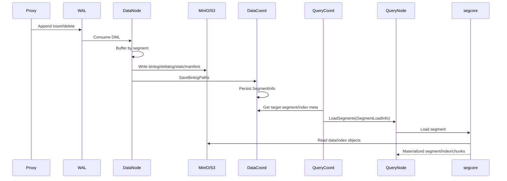

# Milvus 功能设计文档

本文从源码实现角度描述 Milvus 的主要功能域和全流程设计，覆盖 DDL、DML、flush、index、load/release、search/query、delete、compaction 和可观测性。架构视角见 `docs/developer_guides/milvus_architecture_4plus1_design.md`。

## 1. 功能边界

Milvus 对外提供向量数据库能力，主要功能可分为：

- 元数据定义：database、collection、partition、schema、alias、function、index。
- 数据写入：insert、upsert、delete。
- 数据持久化：flush、binlog/deltalog/statslog/manifest 写入。
- 索引生命周期：create/drop/alter/describe index、index build、index file 持久化。
- 查询加载：load/release collection/partition/segment，QueryNode 从对象存储加载数据和索引。
- 查询执行：search、hybrid search、query/retrieve、statistics。
- 后台维护：compaction、import、stats/analyze、snapshot、garbage collection。
- 可观测和控制：metrics、trace、日志、resource group、quota、rate limit、health check。

## 2. 核心数据模型

### 2.1 逻辑对象

| 对象 | 说明 |
| --- | --- |
| Database | collection 的命名空间和配额边界。 |
| Collection | 类似表，包含 schema、字段、函数、分片、属性、一致性级别。 |
| Partition | collection 内的数据划分，可手动指定或由 partition key 路由。 |
| Field | schema 字段，支持 scalar、vector、JSON、text、struct array 等。 |
| Segment | 数据组织和加载的基本单位，包含 growing/sealed/flushed/dropped 等状态。 |
| Channel | collection 的 DML shard，Proxy 写入、DataNode/QueryNode 消费。 |
| Index | field 上的索引定义和每个 segment 的 index build 结果。 |

### 2.2 Segment 状态

```text
Growing
  -> Sealed
  -> Flushing
  -> Flushed
  -> Dropped
```

说明：

- Growing segment 接收实时写入。
- Sealed segment 不再接收新 insert，等待 flush 或已可调度。
- Flushing/Flushed segment 会被 DataNode 写入对象存储并由 DataCoord 保存元数据。
- Dropped segment 不再参与查询，后续由 GC 清理。
- L0 segment 主要承载 delete 数据，用于查询侧删除过滤。

### 2.3 关键跨组件数据结构

| 数据结构 | 生产者 | 消费者 | 用途 |
| --- | --- | --- | --- |
| `msgpb.InsertRequest` / `DeleteRequest` | Proxy | WAL、DataNode、QueryNode | DML 消息体 |
| `datapb.SaveBinlogPathsRequest` | DataNode | DataCoord | 提交对象存储路径、checkpoint、manifest、flush 状态 |
| `datapb.SegmentInfo` | DataCoord | QueryCoord、Proxy、DataNode | segment 元数据事实来源 |
| `model.SegmentIndex` | DataCoord | DataCoord index scheduler | 每个 segment 的 index build 任务元数据 |
| `workerpb.CreateJobRequest` | DataCoord | DataNode index worker | 索引构建任务 |
| `querypb.SegmentLoadInfo` | QueryCoord | QueryNode | segment 加载所需的完整元数据 |
| `querypb.LoadSegmentsRequest` | QueryCoord/ShardDelegator | QueryNode | 加载 sealed/L0/delta/stats/reopen |
| `querypb.SearchRequest` | Proxy/ShardDelegator | QueryNode | 查询执行请求 |

## 3. Collection 生命周期设计

### 3.1 CreateCollection

入口：

- `internal/proxy/impl.go:CreateCollection`
- `internal/rootcoord/create_collection_task.go`
- `internal/rootcoord/ddl_callbacks_create_collection.go`

流程：

```text
Client
  -> Proxy.CreateCollection
  -> createCollectionTask enters DD queue
  -> MixCoord.RootCoord.CreateCollection
  -> RootCoord validates schema and limits
  -> assign collection/partition/field/function IDs
  -> allocate virtual/physical channels
  -> broadcast CreateCollection message
  -> DDL callback writes collection and shard meta
  -> expire Proxy meta cache
```

设计点：

- Proxy 主要负责请求入口和任务排队，RootCoord 才是 collection 元数据权威。
- RootCoord 会处理 shard 数、partition key、field ID、function ID、外部 collection、text storage 要求等校验。
- DDL broadcast 同时写 control channel 和 collection vchannels，使后续写入和读取组件按统一时间线感知 collection。

### 3.2 Drop/Alter Collection

设计点：

- RootCoord 更新 collection meta 和 tombstone。
- 通过 DDL callback 通知 DataCoord/QueryCoord/Proxy cache。
- QueryCoord 释放对应 load target 和 QueryNode 上的数据。
- DataCoord 后续通过 GC 清理对象存储中的历史文件。

### 3.3 Partition

功能：

- CreatePartition、DropPartition、HasPartition、ShowPartitions、LoadPartitions、ReleasePartitions。

设计点：

- partition meta 归 RootCoord 管理。
- QueryCoord 的 load meta 可以按 collection 或 partition 粒度记录。
- partition key 模式下，Proxy 根据 partition key 将行映射到默认 partition 集合。

## 4. DML 写入设计

### 4.1 Insert

入口：

- `internal/proxy/impl.go:Insert`
- `internal/proxy/task_insert.go`
- `internal/proxy/task_insert_streaming.go`

流程：

```text
Client Insert
  -> Proxy health check
  -> external collection write blocking
  -> build insertTask
  -> DML queue
  -> PreExecute:
       validate collection/schema/field
       allocate rowID if needed
       fill timestamp
       check dynamic field / struct field / utf8 / vector format
       resolve partition and channel
  -> Execute:
       split rows by vchannel
       build streaming insert messages
       append messages to WAL
  -> return MutationResult and max timetick
```

设计点：

- Proxy 侧尽量在进入 WAL 前完成用户输入校验。
- rowID/PK/timestamp 在 Proxy 侧确定，保证同一批数据对后续组件是确定的。
- 数据按 PK hash 或 partition key 拆到 vchannel。
- WAL append 成功后返回的 max timetick 可用于 session consistency。

### 4.2 Upsert

Upsert 逻辑接近 insert，但需要结合主键语义生成替换效果。对读路径而言，通常表现为新 insert 加旧值 delete 过滤。

设计点：

- 外部 collection 不支持写入。
- 需要保证主键字段和 schema 约束。
- 与 delete 可见性同样依赖 timestamp。

### 4.3 Delete

入口：

- `internal/proxy/impl.go:Delete`
- `internal/proxy/task_delete.go`

流程：

```text
Client Delete
  -> Proxy validates expression / primary key condition
  -> allocate delete timestamp
  -> route delete message to WAL
  -> QueryNode consumes delete for real-time delete buffer
  -> DataNode persists deltalog or L0 segment
  -> QueryNode later loads deltalog/L0 for sealed data filtering
```

设计点：

- Delete 不直接重写历史 segment。
- 查询时通过 delete buffer、deltalog、L0 segment 和 timestamp 判断行是否可见。
- compaction 可在后台合并删除效果并产出新 segment。

## 5. Flush 与对象存储持久化设计

### 5.1 Flush 触发

入口：

- `internal/proxy/impl.go:Flush`
- `internal/datacoord/services.go:Flush`
- `internal/flushcommon/writebuffer/write_buffer.go`
- `internal/flushcommon/syncmgr/task.go`

流程：

```text
Client Flush
  -> Proxy.Flush
  -> flushTask enters DC queue
  -> DataCoord.Flush allocates flush timestamp
  -> DataCoord seals target growing segments
  -> DataNode write buffer builds SyncTask
  -> SyncTask serializes data
  -> ChunkManager writes files to object storage
  -> MetaWriter.UpdateSync calls DataCoord.SaveBinlogPaths
  -> DataCoord updates segment meta
```

### 5.2 SyncTask 写入

`SyncTask.Run` 根据 segment storage version 选择写入格式：

| Storage version | Writer | 输出 |
| --- | --- | --- |
| V1 / legacy | `BulkPackWriter` | field binlog、statslog、deltalog |
| V2 | `BulkPackWriterV2` | packed column group、stats、delta |
| V3 | `BulkPackWriterV3` | manifest-backed packed data、delta、stats、BM25 |

关键输出：

- `insertBinlogs`
- `deltaBinlog`
- `statsBinlogs`
- `bm25Binlogs`
- `manifestPath`
- `flushedSize`
- checkpoint

### 5.3 SaveBinlogPaths

入口：

- `internal/flushcommon/syncmgr/meta_writer.go:UpdateSync`
- `internal/datacoord/services.go:SaveBinlogPaths`

`SaveBinlogPaths` 处理内容：

- 校验 DataCoord 健康状态。
- 校验 channel owner，避免错误节点提交。
- 压缩/规范化 binlog path。
- 更新 segment 的 binlog、statslog、deltalog、BM25 log。
- 更新 checkpoint 和 start position。
- 更新 manifest path。
- 根据 flush/drop 标志更新 segment 状态。
- flushed 后触发 index build 和 compaction。

### 5.4 DataNode -> MinIO/S3 -> QueryNode

详细链路：



功能含义：

- DataNode 只负责把内存中的写入批次持久化成对象，并把对象路径提交给 DataCoord。
- DataCoord 保存的是后续查询加载所需的对象索引和状态。
- QueryCoord 从 DataCoord 取出这些元数据，生成 `SegmentLoadInfo`。
- QueryNode 不依赖 DataNode 直接传输数据，而是基于 `SegmentLoadInfo` 从对象存储读取 segment 和 index。

## 6. Index 功能设计

### 6.1 CreateIndex

入口：

- `internal/proxy/impl.go:CreateIndex`
- `internal/datacoord/index_service.go:CreateIndex`

流程：

```text
Client CreateIndex
  -> Proxy.CreateIndex
  -> DataCoord.CreateIndex
  -> validate schema field and index params
  -> allocate or reuse indexID
  -> write index meta through broadcast
  -> index scheduler creates segment index tasks
```

设计点：

- index 定义属于 collection/field 级元数据。
- index build 是异步任务，按 flushed segment 生成 segment index job。
- DataCoord 负责判定哪些 segment 需要构建 index。

### 6.2 Index build

入口：

- `internal/datacoord/task_index.go`
- `internal/datanode/index_services.go`
- `internal/datanode/index/task_index.go`

流程：

```text
DataCoord index scheduler
  -> choose DataNode worker slot
  -> workerpb.CreateJobRequest
  -> DataNode.CreateJob
  -> index.NewIndexBuildTask
  -> PreExecute prepares data paths and params
  -> Execute calls indexcgowrapper.CreateIndex
  -> C++/knowhere builds index
  -> PostExecute uploads index files
  -> DataNode task manager stores file keys and serialized size
  -> DataCoord queries job result and updates index meta
```

关键输入：

- collection/partition/segment ID
- field ID/schema
- insert binlog paths 或 Storage V2/V3 segment files/manifest
- index params、type params
- storage config

关键输出：

- index file keys
- serialized size
- memory size
- current index version / scalar index version
- build state and failure reason

### 6.3 QueryNode 加载 index

QueryCoord 打包 `SegmentLoadInfo.IndexInfos`，QueryNode 加载 sealed segment 时把 index 信息传给 segcore。

典型路径：

```text
QueryNode.LoadSegments
  -> segmentLoader.Load
  -> NewSegment
  -> segmentLoader.LoadSegment
  -> LocalSegment.Load
  -> segcore ChunkedSegmentSealedImpl::Load
  -> LoadBatchIndexes
  -> SealedIndexTranslator
  -> IndexFactory / knowhere load
```

设计点：

- 如果 segment 有可用 index，查询优先使用 index。
- 如果 index 不存在或小段 fake finish，可能走 raw data/brute force 或无需训练索引路径。
- disk index、mmap、packed index 会影响 QueryNode 本地缓存和对象读取方式。

## 7. Load / Release 功能设计

### 7.1 LoadCollection / LoadPartitions

入口：

- `internal/proxy/impl.go:LoadCollection`
- `internal/proxy/impl.go:LoadPartitions`
- `internal/querycoordv2/job/job_load.go`

流程：

```text
Client LoadCollection
  -> Proxy task
  -> QueryCoord LoadCollectionJob
  -> DescribeCollection via broker
  -> spawn replicas by resource group config
  -> write collection/partition load meta
  -> TargetObserver.UpdateNextTarget
  -> CollectionObserver tracks loading progress
  -> checkers generate channel and segment tasks
```

设计点：

- load meta 记录 load type、replica number、load fields、resource group、field-index 绑定。
- replica 用于高可用和负载均衡。
- target 表示期望状态，distribution 表示当前 QueryNode 实际持有状态。
- checker 的职责是让 distribution 收敛到 target。

### 7.2 LoadSegments

入口：

- `internal/querycoordv2/task/utils.go:packLoadSegmentRequest`
- `internal/querynodev2/services.go:LoadSegments`
- `internal/querynodev2/segments/segment_loader.go`

`LoadScope`：

| LoadScope | 场景 |
| --- | --- |
| `Full` | 完整加载 sealed segment 的 field data/index/stats/delta |
| `Delta` | leader checker 触发，只加载 delta |
| `Stats` | stats 更新 |
| `Reopen` | schema/index/storage 信息变化后 reopen segment |

QueryNode 执行步骤：

```text
LoadSegments request
  -> health check and index check
  -> fallback empty memory size to log size
  -> optional transfer to shard delegator
  -> Collection.PutOrRef
  -> dispatch by LoadScope
  -> segmentLoader.Load
       prepare: skip loaded/loading segments
       requestResource: estimate memory/disk and concurrency
       NewSegment: create LocalSegment and C++ segment handle
       LoadSegment: read field/index/manifest into segcore
       loadDeltalogs
       load bloom filter / PK candidate
       SegmentManager.Put
```

设计点：

- QueryNode 按 segment 粒度并发加载，但受内存、磁盘、CPU 和配置限制。
- 加载完成后，collection ref count 会增加，防止查询期间被释放。
- L0 segment 有特殊路径，主要服务 delete 过滤。
- Storage V2/V3 manifest segment 会走 column group/manifest reader。

### 7.3 Release

入口：

- `internal/proxy/impl.go:ReleaseCollection`
- `internal/proxy/impl.go:ReleasePartitions`
- `internal/querynodev2/services.go:ReleaseSegments`

设计点：

- QueryCoord 更新 load meta/target。
- checkers 生成 reduce/release task。
- QueryNode 从 SegmentManager 移除 segment，减少 collection ref count。
- UnsubDmChannel 时关闭 pipeline 和 delegator，并清理 growing segment。

## 8. Search / Query 功能设计

### 8.1 Search

入口：

- `internal/proxy/impl.go:Search`
- `internal/proxy/task_search.go`
- `internal/querynodev2/services.go:Search`
- `internal/querynodev2/services.go:SearchSegments`
- `internal/querynodev2/tasks/search_task.go`

Proxy 侧流程：

```text
Search request
  -> health check
  -> optional search-by-PK transform
  -> searchTask.PreExecute
       get collection ID/schema/info
       translate output fields
       parse expression and search params
       resolve partition names/partition key
       calculate guarantee timestamp
       build internal SearchRequest
  -> route to shard leaders by shard client manager
  -> wait partial results
  -> final reduce
  -> optional requery for output fields
```

QueryNode 侧流程：

```text
QueryNode.Search
  -> validate one channel
  -> searchChannel
  -> ShardDelegator.Search
  -> dispatch SearchSegments to local/remote workers
  -> QueryNode.SearchSegments
  -> tasks.SearchTask
  -> collection.NewSearchRequest
  -> SearchHistorical or SearchStreaming
  -> segcore returns SearchResult
  -> encode/reduce result
```

设计点：

- Historical 对 sealed segment 查询，Streaming 对 growing segment 查询。
- filter-only 阶段支持两阶段搜索优化。
- Proxy 可进行 topk reduce、hybrid search、rerank、aggregation、recall evaluation 等高级逻辑。
- 查询可基于 consistency level 推导 guarantee timestamp。

### 8.2 Query / Retrieve

功能：

- 按主键或表达式返回字段数据。
- 支持 output fields、time travel、partition 约束。

设计点：

- Proxy 的 query task 和 search task 类似，负责参数、schema、路由、结果归并。
- QueryNode 的 query task 调用 segcore retrieve。
- 删除过滤和 timestamp 可见性同样生效。

### 8.3 Statistics

功能：

- collection/partition row count。
- QueryNode loaded segment statistics。
- DataCoord persistent segment statistics。

设计点：

- Proxy 对用户暴露统计 API。
- QueryNode 统计 loaded 状态。
- DataCoord 统计持久化 segment 元数据。

## 9. Delete 可见性设计

Delete 的核心是“写入删除日志，查询时过滤”。

数据来源：

- QueryNode streaming pipeline 实时消费 delete。
- DataNode flush deltalog。
- L0 segment 保存 delete 记录。
- compaction 产出的 compact-to delete source 可能通过 legacy deltalog 或 manifest 表达。

读路径处理：

- QueryNode load sealed segment 时加载 deltalog/L0。
- ShardDelegator 维护 delete buffer。
- segcore search/query 根据 timestamp 和 PK 删除信息过滤。
- guarantee timestamp 确保查询看到足够新的 delete。

设计收益：

- delete 写入不需要同步重写大 segment。
- 旧 segment 可继续服务查询，后台 compaction 再合并删除效果。

## 10. Compaction 功能设计

入口和模块：

- `internal/datacoord/compaction_*`
- `internal/datanode/compactor`

类型：

- mix compaction
- L0 compaction
- clustering compaction
- sort compaction
- schema/version bump compaction

流程：

```text
DataCoord trigger/inspector
  -> choose candidate segments
  -> create compaction task
  -> assign to DataNode compactor worker
  -> DataNode reads source binlog/manifest
  -> writes new compacted segment objects
  -> CompleteCompaction
  -> DataCoord updates segment lineage and state
  -> QueryCoord target changes
  -> QueryNode release old segments and load new segment
```

设计点：

- compaction 是后台优化，不阻塞前台写入。
- compaction 会改变 segment lineage，QueryNode 加载时要处理 compact-to delete source。
- DataCoord 是 compaction 元数据和最终提交的权威。

## 11. Import / External Collection

Import 和 external collection 主要绕过普通 insert 的一部分路径，将外部文件转换为 Milvus segment 或直接以 external source 方式查询。

相关模块：

- `internal/datacoord/import_*`
- `internal/datanode/importv2`
- `internal/datanode/external`
- `internal/storagev2/packed`

设计点：

- DataCoord 管理 import job/task 元数据。
- DataNode 执行 preimport/import/copy segment。
- external collection 通常禁止 insert/delete/flush。
- QueryNode 对 external segment 加载和 PK candidate 有特殊逻辑。

## 12. 可观测性设计

### 12.1 Metrics

典型指标：

- Proxy request latency、mutation/search/query count、slow query。
- DataNode flush size、flush rows、save storage latency、index build latency。
- QueryCoord load progress、balance、task 状态。
- QueryNode load latency、search latency、queue latency、segment memory、filesystem metrics。

### 12.2 Trace

源码中通过 OpenTelemetry span 标记关键阶段，例如：

- `Proxy-Insert`
- `Proxy-Search`
- `DataCoord-Flush`
- `DataNode-CreateIndex`
- `LoadCollection`
- `SearchTask`

### 12.3 日志

日志用于串联跨组件行为。对 QueryNode load trace，本仓库新增统一关键字：

```text
[querynode-load-trace]
```

可关联字段包括：

- `collectionID`
- `partitionID`
- `segmentID`
- `fieldID`
- `indexID`
- `buildID`
- `manifestPath`
- `indexFiles`
- `object_va`
- `buffer_va`
- `chunk_va`
- `index_va`
- `column_group_va`
- `loadDuration`
- `read_us`

## 13. 异常处理和幂等性

### 13.1 DML

- Proxy 前置校验失败直接返回。
- WAL append 失败返回错误。
- schema version mismatch 映射为 collection schema mismatch。
- DataNode sync task 失败会走 retry 或 failure callback。

### 13.2 Flush

- `SaveBinlogPaths` 会校验 channel ownership。
- stale segment 或 segment not found 在部分自动 flush 场景可能被视为良性 no-op。
- flush/drop 状态更新通过 DataCoord meta operator 保证一致提交。

### 13.3 Index

- DataCoord index meta 防止重复创建。
- DataNode task manager 防止同一 build task 重复执行。
- worker 执行失败保存 fail reason，DataCoord 后续可重试或标记失败。

### 13.4 Load

- QueryNode `prepare` 会跳过已加载或加载中的 segment。
- loader 使用资源估算避免超过内存/磁盘限制。
- load 失败会释放已创建但未提交的 segment。
- QueryCoord checker 会在 target 与 distribution 不一致时继续调度。

### 13.5 Query

- collection 未加载、channel 未就绪、QueryNode 不健康会返回错误。
- guarantee timestamp 未满足时可能等待或超时。
- inconsistent requery 场景可由 Proxy retry。

## 14. 功能到模块映射

| 功能 | Proxy | RootCoord | DataCoord | DataNode | QueryCoord | QueryNode | Object Storage |
| --- | --- | --- | --- | --- | --- | --- | --- |
| CreateCollection | 接入、排队 | 元数据、DDL broadcast | watch channel/meta callback | 消费后准备写入 | target/load meta 后续使用 | watch/query view 后续使用 | 无 |
| Insert | 校验、PK、WAL append | schema 元数据来源 | segment alloc/checkpoint 元数据 | consume、buffer、flush | 无直接参与 | consume growing 数据 | flush 后写入 |
| Delete | 校验、WAL append | schema 元数据来源 | deltalog/L0 元数据 | persist deltalog/L0 | load delta/L0 target | delete buffer/filter | deltalog/L0 |
| Flush | 发起 | 无直接执行 | seal、checkpoint、SaveBinlogPaths | SyncTask 写对象 | 后续 target 更新 | 后续 load/release | binlog/stats/manifest |
| CreateIndex | 接入 | schema 元数据来源 | index meta、调度 | index worker build/upload | index checker/load target | load index | index files |
| LoadCollection | 接入 | collection 描述来源 | segment/index target 来源 | 无直接参与 | load meta、replica、任务 | load data/index | read objects |
| Search | 接入、路由、reduce | schema 元数据来源 | 无直接参与 | 无直接参与 | distribution/leader 依据 | segcore search | lazy/mmap 可能读取 |
| Query | 接入、路由、reduce | schema 元数据来源 | 无直接参与 | 无直接参与 | distribution/leader 依据 | segcore retrieve | lazy/mmap 可能读取 |
| Compaction | 查询状态可见 | 无直接执行 | trigger/meta | compactor 执行 | target 变化 | release/load 新旧 segment | read/write objects |

## 15. 与 QueryNode Load Trace 改造的关系

本功能设计中的第 5、6、7 章是 QueryNode load trace 的功能背景：

- DataNode flush 决定对象存储中有哪些数据文件。
- DataCoord `SaveBinlogPaths` 决定 QueryCoord 能看到哪些路径和 checkpoint。
- QueryCoord `SegmentLoadInfo` 决定 QueryNode 要加载哪些 segment/index。
- QueryNode loader 和 segcore 决定对象文件进入进程后的 VA、size、chunk/index 物化位置。

因此 trace 日志应优先围绕以下边界打点：

- DataCoord meta 到 QueryCoord load target 的边界。
- QueryCoord `LoadSegmentsRequest` 到 QueryNode `LoadSegments` 的边界。
- QueryNode Go loader 到 C++ segcore 的边界。
- C++ storage 从 MinIO/S3 读取对象到内存 buffer 的边界。
- segcore 将 field data/index/manifest column group 物化为可查询对象的边界。

## 16. 总结

Milvus 的功能设计围绕“元数据控制、WAL 顺序写入、对象存储持久化、QueryNode 本地执行”展开。写入路径把数据转成 WAL 消息和对象存储文件，查询路径则基于 DataCoord 元数据和 QueryCoord 调度把这些文件加载到 QueryNode。`SegmentLoadInfo` 是持久化数据进入查询执行层的关键契约，围绕它可以完整追踪 segment、binlog、index、manifest 从 DataNode 写入到 QueryNode 加载和检索的全过程。
