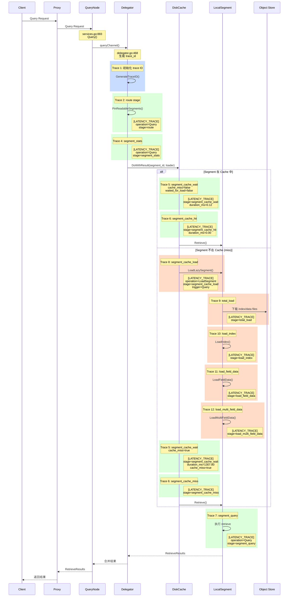
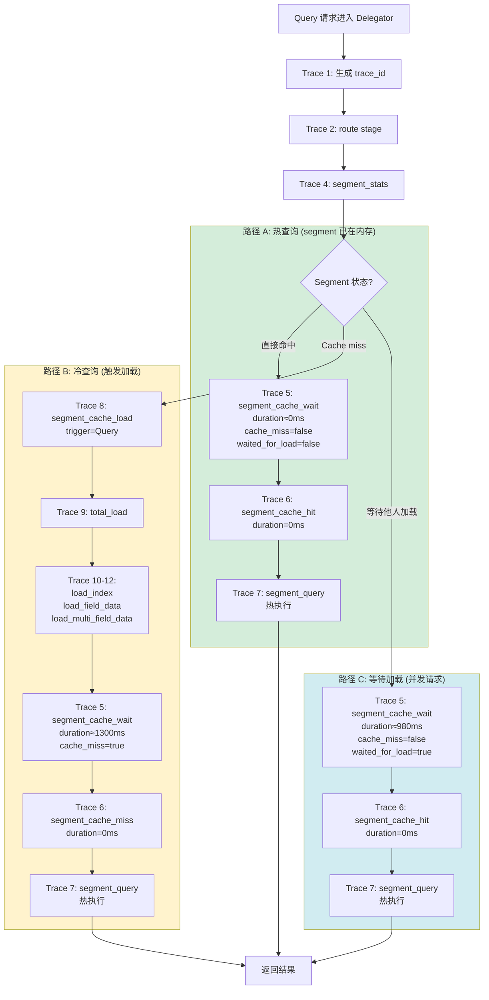

# Milvus Query 流程详解与 Trace 埋点分析（2026-08-11 至 2026-08-17）

生成日期：2026-08-17  
分析基线：commit `b3c10a7db2` 到 `9b363c58fe`  
当前分支：`c_qps2.4.5`

---

## 目录

1. [Milvus Query 流程总览](#1-milvus-query-流程总览)
2. [Query 流程详细步骤（代码级）](#2-query-流程详细步骤代码级)
3. [8月11-17日新增 Trace 埋点清单](#3-811-17日新增-trace-埋点清单)
4. [Trace 日志格式示例](#4-trace-日志格式示例)
5. [完整调用链路图](#5-完整调用链路图)

---

## 1. Milvus Query 流程总览

Milvus Query 请求从客户端到返回结果，主要经过以下阶段：

```
Client SDK
  ↓
Proxy (入口层)
  ↓
QueryNode (执行层)
  ├─ Delegator (路由与分发)
  ├─ Segment Manager (segment 管理)
  ├─ DiskCache (lazy-load 缓存)
  └─ LocalSegment (segment 级执行)
  ↓
返回结果
```

**核心流程**：
1. **Proxy 接收**：客户端请求到达 Proxy
2. **路由分发**：Proxy 将请求路由到对应的 QueryNode
3. **Delegator 处理**：QueryNode 的 Shard Delegator 负责协调
4. **Segment 定位**：确定需要查询的 sealed 和 growing segments
5. **Lazy-load 检查**：如果 segment 不在内存，触发加载
6. **执行查询**：在每个 segment 上执行 query
7. **结果合并**：合并所有 segment 的结果并返回

---

## 2. Query 流程详细步骤（代码级）

### 2.1 入口：QueryNode.Query()

**文件位置**：`internal/querynodev2/services.go:883-961`

```go
func (node *QueryNode) Query(ctx context.Context, req *querypb.QueryRequest) (*internalpb.RetrieveResults, error)
```

**功能**：
- 接收来自 Proxy 的 Query 请求
- 检查 QueryNode 健康状态
- 按 channel 并发执行查询
- 合并各 channel 的结果

**关键代码**：
```go
// services.go:883
func (node *QueryNode) Query(ctx context.Context, req *querypb.QueryRequest) (*internalpb.RetrieveResults, error) {
    // 896行：创建 time recorder
    tr := timerecord.NewTimeRecorderWithTrace(ctx, "QueryRequest")
    
    // 905-928行：按 channel 并发执行
    for i, ch := range req.GetDmlChannels() {
        runningGp.Go(func() error {
            ret, err := node.queryChannel(runningCtx, req, ch)  // 调用 queryChannel
            // ...
        })
    }
    
    // 937行：调用 reducer 合并结果
    reducer := segments.CreateInternalReducer(req, node.manager.Collection.Get(req.GetReq().GetCollectionID()).Schema())
    ret, err := reducer.Reduce(ctx, toMergeResults)
}
```

**无新增 trace**（在此级别）

---

### 2.2 Channel 级查询：queryChannel()

**文件位置**：`internal/querynodev2/handlers.go`（具体实现）

**功能**：
- 获取对应 channel 的 Shard Delegator
- 调用 delegator 的 Query 方法

**代码流程**：
```go
func (node *QueryNode) queryChannel(ctx context.Context, req *querypb.QueryRequest, channel string) (*internalpb.RetrieveResults, error) {
    // 获取 delegator
    delegator, ok := node.delegators.Get(channel)
    
    // 调用 delegator.Query
    results, err := delegator.Query(ctx, req)
}
```

---

### 2.3 Delegator 查询入口

**文件位置**：`internal/querynodev2/delegator/delegator.go:461-575`

#### **新增 Trace 1：初始化 trace ID**

**代码位置**：`delegator.go:468-469`

```go
// Initialize trace ID for query operation
traceID := tracer.GenerateTraceID()
ctx = tracer.SetTraceIDToContext(ctx, traceID)
```

**目的**：为整个 Query 请求生成唯一的 trace ID，用于关联后续所有子阶段

**日志格式**：无直接日志，trace ID 会传播到所有子阶段

---

#### **新增 Trace 2：Route 阶段**

**代码位置**：`delegator.go:498-502`

```go
// Trace: route and pin segments
routeSpan := tracer.TraceQuery(ctx, "route", map[string]interface{}{
    "collection_id": req.GetReq().GetCollectionID(),
    "partitions":    partitions,
})
routeSpan.SetComponent("querynode")
```

**功能**：记录 delegator 路由和定位 segment 的耗时

**结束位置**：`delegator.go:523`
```go
tracer.EndTrace(routeSpan)
```

**日志格式**：
```
[LATENCY_TRACE] trace_id=<uuid> operation=Query stage=route component=querynode duration_ms=1.23 collection_id=123 partitions=[1,2]
```

---

#### **新增 Trace 3：Segment 统计**

**代码位置**：`delegator.go:520-522`

```go
// Record segment statistics
routeSpan.AddMetadata("sealed_count", sealedNum)
routeSpan.AddMetadata("growing_count", len(growing))
```

**功能**：记录本次查询涉及的 sealed 和 growing segment 数量

---

#### **新增 Trace 4：Segment 类型统计事件**

**代码位置**：`delegator.go:526-530`

```go
// Record segment type counts
tracer.GetGlobalTracer().RecordEvent(traceID, "", "Query", "segment_stats", "querynode",
    0, map[string]interface{}{
        "sealed_segments":  sealedNum,
        "growing_segments": len(growing),
    })
```

**日志格式**：
```
[LATENCY_TRACE] trace_id=<uuid> operation=Query stage=segment_stats component=querynode duration_ms=0.00 sealed_segments=10 growing_segments=2
```

---

### 2.4 Segment 级查询执行

**文件位置**：`internal/querynodev2/segments/segment_do.go:17-136`

#### **新增 Trace 5：Cache 等待时间追踪**

**代码位置**：`segment_do.go:93-110`

```go
var result cache.DoResult
var missing bool
traceCtx := withLatencyTraceOperation(ctx, "Query")
cacheWaitStart := time.Now()
cacheWaitDuration := time.Duration(0)
doStarted := false

result, err = mgr.DiskCache.DoWithResult(traceCtx, seg.ID(), func(ctx context.Context, segment Segment) error {
    cacheWaitDuration = time.Since(cacheWaitStart)
    doStarted = true
    return do(ctx, segment)
})

missing = result.Missing
if !doStarted {
    cacheWaitDuration = time.Since(cacheWaitStart)
}
recordSegmentCacheWait(traceCtx, "Query", seg, cacheWaitDuration, missing, result.WaitedForLoad, err)
```

**功能**：
- 记录从进入 DiskCache.Do 到实际执行前的等待时间
- 区分三种情况：
  1. `cache_miss=true`：需要从对象存储加载
  2. `cache_miss=false, waited_for_load=true`：等待其他请求加载
  3. `cache_miss=false, waited_for_load=false`：直接命中缓存

**辅助函数**：`segment_do.go:29-57`

```go
func recordSegmentCacheWait(ctx context.Context, operation string, segment Segment, duration time.Duration, missing bool, waitedForLoad bool, err error) {
    source := "querynode_cache"
    if missing {
        source = "object_store"
    } else if waitedForLoad {
        source = "wait_for_loader"
    }
    status := "ok"
    if err != nil {
        status = "error"
    }
    tracer.GetGlobalTracer().RecordEvent(
        tracer.GetTraceIDFromContext(ctx),
        "",
        operation,
        "segment_cache_wait",
        "querynode",
        duration,
        map[string]interface{}{
            "source":           source,
            "collection_id":    segment.Collection(),
            "partition_id":     segment.Partition(),
            "segment_id":       segment.ID(),
            "segment_type":     segment.Type().String(),
            "cache_miss":       missing,
            "cache_hit":        !missing,
            "waited_for_load":  waitedForLoad,
            "status":           status,
        },
    )
}
```

**日志格式（三种情况）**：

1. **直接命中**：
```
[LATENCY_TRACE] trace_id=<uuid> operation=Query stage=segment_cache_wait component=querynode duration_ms=0.12 source=querynode_cache collection_id=123 partition_id=1 segment_id=456 segment_type=Sealed cache_miss=false cache_hit=true waited_for_load=false status=ok
```

2. **等待其他加载**：
```
[LATENCY_TRACE] trace_id=<uuid> operation=Query stage=segment_cache_wait component=querynode duration_ms=1234.56 source=wait_for_loader collection_id=123 partition_id=1 segment_id=456 segment_type=Sealed cache_miss=false cache_hit=true waited_for_load=true status=ok
```

3. **触发加载**：
```
[LATENCY_TRACE] trace_id=<uuid> operation=Query stage=segment_cache_wait component=querynode duration_ms=2345.67 source=object_store collection_id=123 partition_id=1 segment_id=456 segment_type=Sealed cache_miss=true cache_hit=false waited_for_load=false status=ok
```

---

#### **新增 Trace 6：Cache 访问结果事件**

**代码位置**：`segment_do.go:113`

```go
recordSegmentCacheAccess(traceCtx, "Query", seg, !missing)
```

**辅助函数**：`segment_do.go:59-82`

```go
func recordSegmentCacheAccess(ctx context.Context, operation string, segment Segment, hit bool) {
    stage := "segment_cache_hit"
    source := "querynode_cache"
    if !hit {
        stage = "segment_cache_miss"
        source = "object_store"
    }
    tracer.GetGlobalTracer().RecordEvent(
        tracer.GetTraceIDFromContext(ctx),
        "",
        operation,
        stage,
        "querynode",
        0,
        map[string]interface{}{
            "source":        source,
            "collection_id": segment.Collection(),
            "partition_id":  segment.Partition(),
            "segment_id":    segment.ID(),
            "segment_type":  segment.Type().String(),
        },
    )
}
```

**日志格式**：
```
[LATENCY_TRACE] trace_id=<uuid> operation=Query stage=segment_cache_hit component=querynode duration_ms=0.00 source=querynode_cache collection_id=123 partition_id=1 segment_id=456 segment_type=Sealed

# 或者

[LATENCY_TRACE] trace_id=<uuid> operation=Query stage=segment_cache_miss component=querynode duration_ms=0.00 source=object_store collection_id=123 partition_id=1 segment_id=456 segment_type=Sealed
```

**注意**：这是 0ms 的计数事件，不是实际耗时

---

### 2.5 Segment 执行 Query

**文件位置**：`internal/querynodev2/segments/segment.go:612-644`

#### **新增 Trace 7：Segment 级 Query 执行**

**代码位置**：`segment.go:612-628`

```go
func (s *LocalSegment) Retrieve(ctx context.Context, plan *RetrievePlan) (*segcorepb.RetrieveResults, error) {
    querySpan := tracer.GetGlobalTracer().StartSpan(
        tracer.GetTraceIDFromContext(ctx),
        "",
        "Query",
        "segment_query",
        "querynode",
        map[string]interface{}{
            "source":        "querynode_cache",
            "collection_id": s.Collection(),
            "partition_id":  s.Partition(),
            "segment_id":    s.ID(),
            "segment_type":  s.segmentType.String(),
            "msg_id":        plan.msgID,
        },
    )
    defer tracer.EndTrace(querySpan)
    
    // 实际执行 retrieve...
}
```

**日志格式**：
```
[LATENCY_TRACE] trace_id=<uuid> operation=Query stage=segment_query component=querynode duration_ms=12.34 source=querynode_cache collection_id=123 partition_id=1 segment_id=456 segment_type=Sealed msg_id=789
```

**为什么这样加**：
- 记录每个 segment 上实际执行 query 的耗时
- `source=querynode_cache` 表示数据已在内存中
- `msg_id` 用于关联具体的请求

---

### 2.6 Lazy-load：Segment 加载流程

当 `cache_miss=true` 时，会触发 segment 加载流程。

#### **新增 Trace 8：Segment Cache Load 触发**

**文件位置**：`internal/querynodev2/segments/manager.go`（DiskCache loader 回调）

**代码片段**：
```go
loadSpan := tracer.GetGlobalTracer().StartSpan(
    tracer.GetTraceIDFromContext(ctx),
    "",
    "LoadSegment",
    "segment_cache_load",
    "querynode",
    map[string]interface{}{
        "source":        "object_store",
        "collection_id": segment.Collection(),
        "partition_id":  segment.Partition(),
        "segment_id":    segment.ID(),
        "segment_type":  segment.Type().String(),
        "num_rows":      loadInfo.GetNumOfRows(),
        "trigger":       "Query",  // 或 "Search"
    },
)
defer tracer.EndTrace(loadSpan)
```

**日志格式**：
```
[LATENCY_TRACE] trace_id=<uuid> operation=LoadSegment stage=segment_cache_load component=querynode duration_ms=1234.56 source=object_store collection_id=123 partition_id=1 segment_id=456 segment_type=Sealed num_rows=100000 trigger=Query
```

---

#### **新增 Trace 9：LoadSegment 总耗时**

**文件位置**：`internal/querynodev2/segments/segment_loader.go:428-436`

**代码位置**：
```go
func (loader *segmentLoaderV2) LoadSegment(ctx context.Context,
    segment *LocalSegment,
    loadInfo *querypb.SegmentLoadInfo,
) (err error) {
    // Trace: start load segment span
    loadSpan := traceSegmentLoadStage(ctx, "total_load", segment, map[string]interface{}{
        "num_rows": loadInfo.GetNumOfRows(),
    })
    defer tracer.EndTrace(loadSpan)
    
    // 实际加载逻辑...
}
```

**辅助函数**：`segment_loader.go:74-90`

```go
func traceSegmentLoadStage(ctx context.Context, stage string, segment *LocalSegment, metadata map[string]interface{}) *tracer.SpanContext {
    if metadata == nil {
        metadata = make(map[string]interface{})
    }
    metadata["source"] = "object_store"
    metadata["collection_id"] = segment.Collection()
    metadata["partition_id"] = segment.Partition()
    metadata["segment_id"] = segment.ID()
    metadata["segment_type"] = segment.Type().String()
    return tracer.GetGlobalTracer().StartSpan(
        tracer.GetTraceIDFromContext(ctx),
        "",
        "LoadSegment",
        stage,
        "querynode",
        metadata,
    )
}
```

**日志格式**：
```
[LATENCY_TRACE] trace_id=<uuid> operation=LoadSegment stage=total_load component=querynode duration_ms=1200.00 source=object_store collection_id=123 partition_id=1 segment_id=456 segment_type=Sealed num_rows=100000
```

---

#### **新增 Trace 10：Load Index 子阶段**

**文件位置**：`internal/querynodev2/segments/segment.go:1291-1299`

```go
func (s *LocalSegment) LoadIndex(ctx context.Context, indexInfo *querypb.FieldIndexInfo, fieldType schemapb.DataType) error {
    loadSpan := traceSegmentLoadStage(ctx, "load_index", s, map[string]interface{}{
        "field_id":         indexInfo.GetFieldID(),
        "index_id":         indexInfo.GetIndexID(),
        "index_file_count": len(indexInfo.GetIndexFilePaths()),
        "field_type":       fieldType.String(),
    })
    defer tracer.EndTrace(loadSpan)
    
    // 实际加载索引...
}
```

**日志格式**：
```
[LATENCY_TRACE] trace_id=<uuid> operation=LoadSegment stage=load_index component=querynode duration_ms=500.00 source=object_store collection_id=123 partition_id=1 segment_id=456 segment_type=Sealed field_id=102 index_id=9001 index_file_count=16 field_type=FloatVector
```

---

#### **新增 Trace 11：Load Field Data 子阶段**

**文件位置**：`internal/querynodev2/segments/segment.go:987-999`

```go
func (s *LocalSegment) LoadFieldData(ctx context.Context, fieldID int64, rowCount int64, field *datapb.FieldBinlog, useMmap bool) error {
    binlogCount := 0
    if field != nil {
        binlogCount = len(field.GetBinlogs())
    }
    loadSpan := traceSegmentLoadStage(ctx, "load_field_data", s, map[string]interface{}{
        "field_id":     fieldID,
        "row_count":    rowCount,
        "binlog_count": binlogCount,
        "use_mmap":     useMmap,
    })
    defer tracer.EndTrace(loadSpan)
    
    // 实际加载字段数据...
}
```

**日志格式**：
```
[LATENCY_TRACE] trace_id=<uuid> operation=LoadSegment stage=load_field_data component=querynode duration_ms=80.00 source=object_store collection_id=123 partition_id=1 segment_id=456 segment_type=Sealed field_id=101 row_count=100000 binlog_count=4 use_mmap=false
```

---

#### **新增 Trace 12：Load Multi Field Data 子阶段**

**文件位置**：`internal/querynodev2/segments/segment.go:916-922`

```go
func (s *LocalSegment) LoadMultiFieldData(ctx context.Context) error {
    loadInfo := s.loadInfo.Load()
    rowCount := loadInfo.GetNumOfRows()
    fields := loadInfo.GetBinlogPaths()
    loadSpan := traceSegmentLoadStage(ctx, "load_multi_field_data", s, map[string]interface{}{
        "field_count": len(fields),
        "row_count":   rowCount,
    })
    defer tracer.EndTrace(loadSpan)
    
    // 实际加载多字段...
}
```

**日志格式**：
```
[LATENCY_TRACE] trace_id=<uuid> operation=LoadSegment stage=load_multi_field_data component=querynode duration_ms=150.00 source=object_store collection_id=123 partition_id=1 segment_id=456 segment_type=Sealed field_count=5 row_count=100000
```

---

### 2.7 Cache 语义增强

**文件位置**：`pkg/util/cache/cache.go`

#### **修改：DoWithResult 返回详细状态**

**新增结构体**：
```go
type DoResult struct {
    Missing       bool  // 是否 cache miss，需要执行 loader
    WaitedForLoad bool  // 是否等待其他并发请求加载
}
```

**新增方法**：
```go
func (c *lazyLoadCache[K, V]) DoWithResult(ctx context.Context, key K, loader func(context.Context, V) error) (DoResult, error)
```

**为什么这样改**：
- 原来的 `Do()` 只返回 `missing bool`，无法区分"等待其他 loader"的情况
- 新的 `DoWithResult()` 可以明确区分三种状态：
  1. 直接命中（Missing=false, WaitedForLoad=false）
  2. 等待他人加载（Missing=false, WaitedForLoad=true）
  3. 自己触发加载（Missing=true, WaitedForLoad=false）

---

## 3. 8/11-17日新增 Trace 埋点清单

### 3.1 Query 流程埋点总表

| # | Trace Stage | 文件位置 | 行号 | 目的 | 日志 operation | 日志 stage |
|---|-------------|---------|------|------|---------------|-----------|
| 1 | 初始化 trace ID | delegator/delegator.go | 468-469 | 生成唯一 trace ID | - | - |
| 2 | Route 阶段 | delegator/delegator.go | 498-502, 523 | 路由和 pin segment 耗时 | Query | route |
| 3 | Segment 统计 | delegator/delegator.go | 520-522 | 记录 sealed/growing 数量 | Query | route (metadata) |
| 4 | Segment 类型事件 | delegator/delegator.go | 526-530 | 记录 segment 类型分布 | Query | segment_stats |
| 5 | Cache 等待 | segments/segment_do.go | 93-110 | 记录 cache 访问等待时间 | Query | segment_cache_wait |
| 6 | Cache 访问结果 | segments/segment_do.go | 113 | 记录 hit/miss 结果 | Query | segment_cache_hit/miss |
| 7 | Segment Query | segments/segment.go | 612-628 | 记录单个 segment 执行耗时 | Query | segment_query |
| 8 | Cache Load 触发 | segments/manager.go | - | 记录 lazy-load 触发 | LoadSegment | segment_cache_load |
| 9 | LoadSegment 总耗时 | segments/segment_loader.go | 428-436 | 记录整个加载耗时 | LoadSegment | total_load |
| 10 | Load Index | segments/segment.go | 1291-1299 | 记录索引加载耗时 | LoadSegment | load_index |
| 11 | Load Field Data | segments/segment.go | 987-999 | 记录字段加载耗时 | LoadSegment | load_field_data |
| 12 | Load Multi Field | segments/segment.go | 916-922 | 记录多字段加载耗时 | LoadSegment | load_multi_field_data |

### 3.2 Search 流程埋点（类似 Query）

| # | Trace Stage | 文件位置 | 行号 | 差异说明 |
|---|-------------|---------|------|---------|
| 1 | Route 阶段 | delegator/delegator.go | 298-311 | operation=Search |
| 2 | Segment 统计 | delegator/delegator.go | 305-313 | operation=Search |
| 3 | Cache 等待 | segments/search.go | 84-108 | operation=Search |
| 4 | Cache 访问结果 | segments/search.go | 105 | operation=Search |
| 5 | Segment Search | segments/segment.go | 555-573 | operation=Search, stage=segment_search |
| 6 | Stream Search | segments/search.go | 189-213 | 流式 search 的 cache 等待 |

---

## 4. Trace 日志格式示例

### 4.1 热查询（Segment 已在内存）

```text
[LATENCY_TRACE] trace_id=abc-123 operation=Query stage=route component=querynode duration_ms=0.85 collection_id=100 partitions=[1,2] sealed_count=10 growing_count=2

[LATENCY_TRACE] trace_id=abc-123 operation=Query stage=segment_stats component=querynode duration_ms=0.00 sealed_segments=10 growing_segments=2

[LATENCY_TRACE] trace_id=abc-123 operation=Query stage=segment_cache_wait component=querynode duration_ms=0.12 source=querynode_cache collection_id=100 partition_id=1 segment_id=501 segment_type=Sealed cache_miss=false cache_hit=true waited_for_load=false status=ok

[LATENCY_TRACE] trace_id=abc-123 operation=Query stage=segment_cache_hit component=querynode duration_ms=0.00 source=querynode_cache collection_id=100 partition_id=1 segment_id=501 segment_type=Sealed

[LATENCY_TRACE] trace_id=abc-123 operation=Query stage=segment_query component=querynode duration_ms=8.45 source=querynode_cache collection_id=100 partition_id=1 segment_id=501 segment_type=Sealed msg_id=777

# 其他 segment 的 segment_query...
```

### 4.2 冷查询（触发 Lazy-load）

```text
[LATENCY_TRACE] trace_id=xyz-456 operation=Query stage=route component=querynode duration_ms=1.20 collection_id=100 partitions=[1] sealed_count=5 growing_count=0

[LATENCY_TRACE] trace_id=xyz-456 operation=Query stage=segment_stats component=querynode duration_ms=0.00 sealed_segments=5 growing_segments=0

# 触发加载
[LATENCY_TRACE] trace_id=xyz-456 operation=LoadSegment stage=segment_cache_load component=querynode duration_ms=1305.23 source=object_store collection_id=100 partition_id=1 segment_id=502 segment_type=Sealed num_rows=100000 trigger=Query

[LATENCY_TRACE] trace_id=xyz-456 operation=LoadSegment stage=total_load component=querynode duration_ms=1300.00 source=object_store collection_id=100 partition_id=1 segment_id=502 segment_type=Sealed num_rows=100000

[LATENCY_TRACE] trace_id=xyz-456 operation=LoadSegment stage=load_index component=querynode duration_ms=510.50 source=object_store collection_id=100 partition_id=1 segment_id=502 segment_type=Sealed field_id=102 index_id=9001 index_file_count=16 field_type=FloatVector

[LATENCY_TRACE] trace_id=xyz-456 operation=LoadSegment stage=load_field_data component=querynode duration_ms=80.30 source=object_store collection_id=100 partition_id=1 segment_id=502 segment_type=Sealed field_id=101 row_count=100000 binlog_count=4 use_mmap=false

[LATENCY_TRACE] trace_id=xyz-456 operation=LoadSegment stage=load_multi_field_data component=querynode duration_ms=120.45 source=object_store collection_id=100 partition_id=1 segment_id=502 segment_type=Sealed field_count=3 row_count=100000

# 加载完成后的等待记录
[LATENCY_TRACE] trace_id=xyz-456 operation=Query stage=segment_cache_wait component=querynode duration_ms=1307.80 source=object_store collection_id=100 partition_id=1 segment_id=502 segment_type=Sealed cache_miss=true cache_hit=false waited_for_load=false status=ok

[LATENCY_TRACE] trace_id=xyz-456 operation=Query stage=segment_cache_miss component=querynode duration_ms=0.00 source=object_store collection_id=100 partition_id=1 segment_id=502 segment_type=Sealed

# 执行 query
[LATENCY_TRACE] trace_id=xyz-456 operation=Query stage=segment_query component=querynode duration_ms=9.20 source=querynode_cache collection_id=100 partition_id=1 segment_id=502 segment_type=Sealed msg_id=888
```

### 4.3 等待其他加载（并发请求）

```text
[LATENCY_TRACE] trace_id=pqr-789 operation=Query stage=route component=querynode duration_ms=1.10 collection_id=100 partitions=[1] sealed_count=5 growing_count=0

[LATENCY_TRACE] trace_id=pqr-789 operation=Query stage=segment_stats component=querynode duration_ms=0.00 sealed_segments=5 growing_segments=0

# 等待其他请求加载（没有自己的 LoadSegment 日志）
[LATENCY_TRACE] trace_id=pqr-789 operation=Query stage=segment_cache_wait component=querynode duration_ms=980.50 source=wait_for_loader collection_id=100 partition_id=1 segment_id=502 segment_type=Sealed cache_miss=false cache_hit=true waited_for_load=true status=ok

[LATENCY_TRACE] trace_id=pqr-789 operation=Query stage=segment_cache_hit component=querynode duration_ms=0.00 source=querynode_cache collection_id=100 partition_id=1 segment_id=502 segment_type=Sealed

# 执行 query
[LATENCY_TRACE] trace_id=pqr-789 operation=Query stage=segment_query component=querynode duration_ms=8.90 source=querynode_cache collection_id=100 partition_id=1 segment_id=502 segment_type=Sealed msg_id=889
```

---

## 5. 完整调用链路图

### 5.1 Query 流程序列图（带 trace 点）



### 5.2 三种 Query 路径对比



---

## 6. 关键要点总结

### 6.1 为什么这样加 Trace

1. **区分三种查询路径**：
   - 热查询：segment 已在内存，直接执行
   - 冷查询：触发 lazy-load，从对象存储加载
   - 等待查询：被其他并发请求的加载阻塞

2. **精确测量等待时间**：
   - `segment_cache_wait` 记录从进入 DiskCache 到实际执行的等待时间
   - 通过 `cache_miss` 和 `waited_for_load` 区分等待原因

3. **定位加载瓶颈**：
   - `total_load` 记录总加载时间
   - `load_index`、`load_field_data` 等子阶段定位具体瓶颈

4. **追踪请求链路**：
   - 每个请求有唯一的 `trace_id`
   - 所有子阶段通过 `trace_id` 关联

### 6.2 日志格式统一

所有 trace 日志格式：
```
[LATENCY_TRACE] trace_id=<uuid> operation=<op> stage=<stage> component=<component> duration_ms=<ms> <metadata...>
```

**固定字段**：
- `trace_id`：请求唯一标识
- `operation`：Query / Search / LoadSegment / Insert / Flush
- `stage`：route / segment_query / segment_cache_wait / load_index 等
- `component`：querynode / datanode / proxy / querycoord
- `duration_ms`：该阶段耗时（毫秒）

**动态 metadata**：
- `collection_id`、`partition_id`、`segment_id`
- `cache_miss`、`cache_hit`、`waited_for_load`
- `source`：querynode_cache / object_store / wait_for_loader
- `trigger`：Search / Query / Unknown（触发加载的原因）
- `field_id`、`index_id`、`num_rows` 等具体字段

### 6.3 分析建议

**判断 lazy-load 影响**：
1. 查看 `segment_cache_wait` 的 duration 分布
2. 按 `cache_miss` 和 `waited_for_load` 分组统计
3. 对比 `segment_cache_load` 和 `segment_query` 的耗时

**定位加载瓶颈**：
1. 查看 `total_load` 总耗时
2. 对比 `load_index`、`load_field_data`、`load_multi_field_data` 的占比
3. 分析 `index_file_count`、`binlog_count` 与耗时的关系

**优化方向**：
- 如果 `load_index` 占比高：优化索引加载或减少索引文件数
- 如果 `load_field_data` 占比高：优化字段数据加载或使用 mmap
- 如果 `waited_for_load=true` 请求多：考虑预加载或增加并发加载能力

---

## 附录：相关文件清单

### 修改文件列表

| 文件 | 主要修改 | 行数变化 |
|------|---------|---------|
| `pkg/tracer/latency_tracer.go` | 新增 trace 基础设施 | +255 |
| `pkg/tracer/init.go` | 初始化 tracer | +58 |
| `internal/querynodev2/delegator/delegator.go` | Query route 和 segment_stats trace | +32 |
| `internal/querynodev2/segments/segment_do.go` | Cache wait 和 access trace | +86 |
| `internal/querynodev2/segments/segment.go` | segment_query 和 load 子阶段 trace | +60 |
| `internal/querynodev2/segments/search.go` | Search cache wait trace | +36 |
| `internal/querynodev2/segments/segment_loader.go` | LoadSegment 总耗时和子阶段 trace | +138 |
| `internal/querynodev2/segments/manager.go` | segment_cache_load 触发 trace | +23 |
| `pkg/util/cache/cache.go` | DoWithResult 增强 | +38 |
| `scripts/analyze_latency_traces.py` | 日志分析脚本 | +1684 |

### 参考文档

- `docs/latency_path_analysis_2026-08-17.md`：完整的时延路径分析报告
- `README_LATENCY_TRACING.md`：Trace 功能使用说明
- `docs/QUICKSTART_LATENCY_ANALYSIS.md`：快速开始指南

---

**文档版本**：v1.0  
**生成时间**：2026-08-17  
**作者**：Claude (Opus 5)
