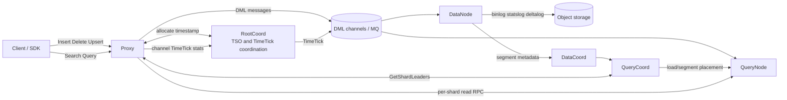
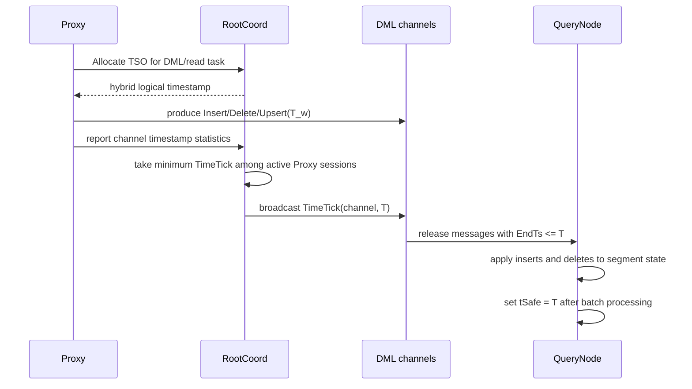
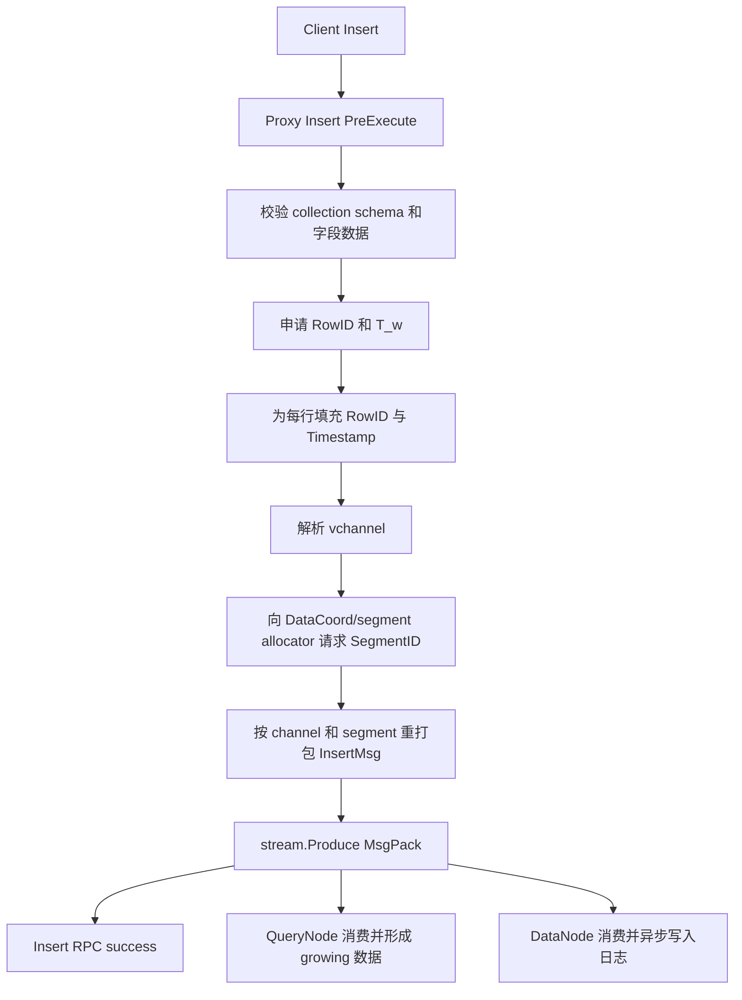
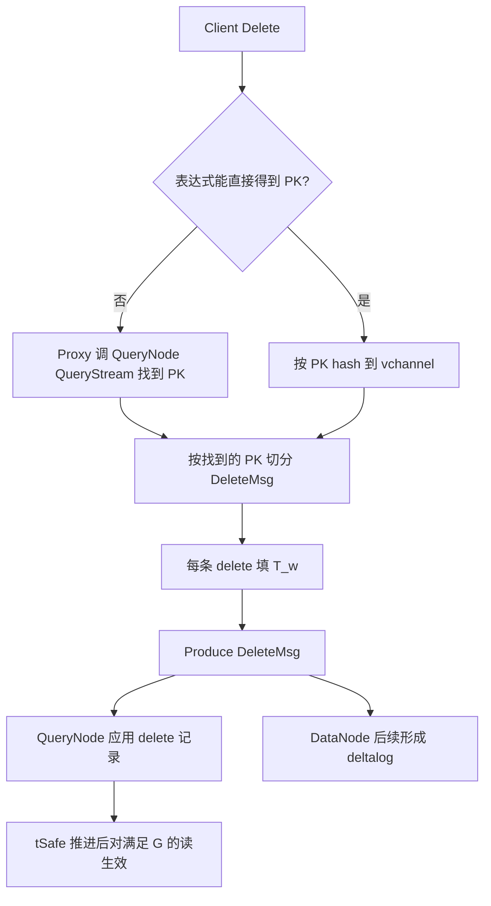
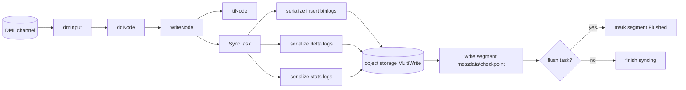
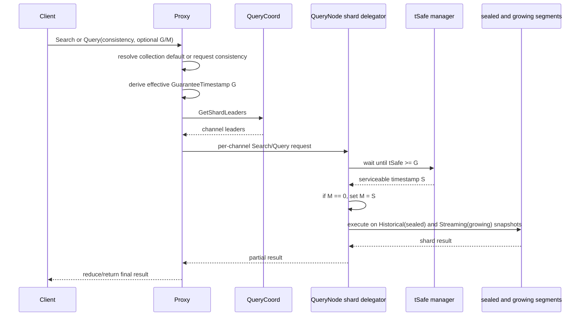

# Milvus 读写模型与一致性保证研究报告

- 日期：2026-09-03
- 源码基线：当前工作区 `tr_v2`，`v2.4.5-3-g6e35813d56`（commit `6e35813d561c13d3bc3e1e980f9428b827162031`）
- 范围：Milvus 2.4.5 系列的 Proxy、RootCoord、消息流、DataNode、QueryCoord 和 QueryNode 读写主路径。
- 方法：本文以当前 checkout 的实现为准。`[代码事实]` 可由列出的源码位置直接验证；`[架构解释]` 是基于这些事实的流程归纳；`[边界]` 表示不能由当前证据推导出的承诺。

## 1. 结论摘要

Milvus 的核心数据模型是**带混合逻辑时间戳的异步消息驱动 MVCC 模型**：

1. 写入由 Proxy 校验、分片并写入 DML 消息流；写 RPC 返回代表 Proxy 已成功完成消息生产，不代表 QueryNode 已消费、数据已经落盘、索引已完成或集合已加载。
2. 同一逻辑变更带有 TSO 分配的时间戳。Insert、Delete 和 Upsert 的消息均携带该时间维度，读取通过 `GuaranteeTimestamp` 指定“至少推进到哪里”。
3. RootCoord、Proxy 和消息流共同推进 TimeTick；QueryNode 在完成一个消费批次的 insert/delete 应用后推进该 channel 的 `tSafe`。
4. 新写入不需要等待 sealed 或 flush 才能被读到；QueryNode 会把已消费的 insert 应用到 growing segment，普通 Search/Query 默认同时读取 sealed/historical 与 growing/streaming 数据。
5. Search/Query 到达 QueryNode 后，先等待 `tSafe >= GuaranteeTimestamp`，再选择 MVCC 快照。若调用方未指定 `MvccTimestamp`，实现将其设为实际返回的 `tSafe`。
6. Strong、Bounded、Session 和 Eventually 的差别主要是读取所要求的最小可见时间栅栏，而不是不同的存储事务协议。
7. DataNode 的异步 sync/flush 将 binlog、statslog、deltalog 写入对象存储并更新元数据；这是持久化流程，独立于读路径的 `tSafe` 可见性流程。

因此，理解 Milvus 读写语义时必须区分以下四个状态：

| 状态 | 成立条件 | 不自动推出 |
|---|---|---|
| 写入已接受 | Proxy 的 `stream.Produce` 成功，RPC 返回成功 | QueryNode 已消费、查询可见、对象存储已写入 |
| 写入对读可见 | 相关 QueryNode 已将 DML 应用到 growing 或 sealed 可查询数据，并使 `tSafe` 越过读请求栅栏 | Flush 完成、索引完成、数据永久保存 |
| 已持久化 | DataNode sync task 成功写入对象存储并更新元数据 | 请求对应的 QueryNode 已加载该 segment |
| 已加载可服务 | QueryCoord 已调度 segment，QueryNode 的 shard/delegator 可服务该 channel | 最新 DML 一定已越过当前读请求的时间栅栏 |

## 2. 组件、数据对象与责任边界

| 组件 | 写路径责任 | 读路径责任 | 关键边界 |
|---|---|---|---|
| Client/SDK | 发起 DML、选择读一致性和可选时间戳 | 等待写 RPC 后再发读，决定是否传入 session/custom guarantee | 客户端顺序是 read-after-write 闭环的前提 |
| Proxy | 校验 schema/data，申请时间戳，分配 RowID/SegmentID，按 vchannel 生产 DML | 解析一致性级别，向 QueryCoord 获取 shard leader，分发和归并结果 | 不等待 DataNode/QueryNode 消费后才返回 DML RPC |
| RootCoord | 提供 TSO；协调各 Proxy 上报的 channel TimeTick | 无直接向量检索执行职责 | 提供时间顺序与 channel 推进协调 |
| 消息队列/MsgStream | 持久或传输 DML、TimeTick（具体可靠性取决于部署的 MQ） | 将跨 channel 消费推进组织为一致的时间批次 | 是写入异步传播媒介，不是查询节点内存状态 |
| DataNode/DataCoord | 消费 DML，形成 binlog/statslog/deltalog，flush、compaction、元数据更新 | 为 sealed segment 的持久化和后续加载提供数据与元数据 | 落盘进度不是 QueryNode `tSafe` 的同义词 |
| QueryCoord | 分配/迁移/平衡 QueryNode 的 segment 和 channel | 向 Proxy 提供 shard leader，调度加载与索引信息 | 路由可用性与数据新鲜度是两个条件 |
| QueryNode | 消费 DML，维护 growing segment、sealed segment 的删除状态，推进 `tSafe` | 等待 `tSafe`，默认同时按 MVCC 时间读取 sealed/historical 和 growing/streaming 数据 | 实际读快照在这里确定 |
| Object storage | 保存 insert/stat/delta log、索引及 segment 相关文件 | 被加载流程读取 | 对象存储完成不等价于实时读可见 |

下图概括数据面和控制面的分工。



## 3. 时间模型与可见性模型

### 3.1 时间符号

| 符号 | 含义 | 代码依据 |
|---|---|---|
| `T_w` | 一条逻辑 DML 任务的写时间戳；Insert/Upsert 行时间戳和 Delete 时间戳由任务时间填入 | `internal/proxy/task_insert.go:97-216`、`internal/proxy/task_delete.go:125-186`、`internal/proxy/task_upsert.go:140-366` |
| `T_r` / `tMax` | 当前读任务取得的最大逻辑时间戳，用于计算有效的保证时间戳 | `internal/proxy/task_search.go:223-240`、`internal/proxy/task_query.go:415-431` |
| `G` | `GuaranteeTimestamp`：读请求要求的最小新鲜度门槛 | 同上；`internal/querynodev2/delegator/delegator.go:266-285`、`454-473` |
| `S` | QueryNode 当前 channel/delegator 的 `tSafe`，表示已完成应用并可作为读服务边界的时间 | `internal/querynodev2/pipeline/delete_node.go:65-87`、`internal/querynodev2/tsafe/manager.go:62-147` |
| `M` | `MvccTimestamp`：实际查询快照时间。请求未显式指定时，QueryNode 采用等待返回的 `tSafe` | `internal/querynodev2/delegator/delegator.go:268-274`、`456-462` |

### 3.2 必须区分的概念

`GuaranteeTimestamp` 不是 `MvccTimestamp`。

- `[代码事实]` QueryNode 先执行 `waitTSafe(ctx, GuaranteeTimestamp)`，得到 `tSafe`；只有当请求的 `MvccTimestamp == 0` 时，才写入 `MvccTimestamp = tSafe`。见 `internal/querynodev2/delegator/delegator.go:266-285`、`454-473`。
- `[架构解释]` `G` 是最小新鲜度下界，`M` 是读实际采用的快照。默认情况下有 `M = S` 且 `S >= G`，所以默认快照可能晚于请求门槛。
- `[边界]` 因为 `M` 可能大于 `G`，Strong 不应被描述为“严格读取恰好等于 `tMax` 的快照”；从当前代码能确认的是 freshness barrier 加上实际可服务快照，而不是通用 SQL 事务快照语义。

`tSafe` 也不是物理墙钟同步。

- `[代码事实]` 通用 TimeTick 消费器只有在所有参与 consumer channel 到达同一时间戳时才释放一个批次，并只将 `EndTs <= currTs` 的普通消息放入该批次。见 `pkg/mq/msgstream/mq_msgstream.go:650-735`、`816-839`。
- `[代码事实]` QueryNode delete node 处理完 batch 后才以该 batch 最大时间戳更新 `tSafe`。见 `internal/querynodev2/pipeline/delete_node.go:65-87`。
- `[架构解释]` `tSafe` 是“该读取副本已经处理到的逻辑数据水位”，不是 NTP/PTP 意义上的各服务器物理时钟相等。

### 3.3 TSO 与 TimeTick 推进



`[代码事实]`

- Proxy 通过 RootCoord 获取时间戳：`internal/proxy/timestamp.go:48-80`；RootCoord TSO 服务实现见 `internal/rootcoord/root_coord.go:1573-1599`。
- DML 任务队列串行管理时间戳分配和 physical channel 统计：`internal/proxy/task_scheduler.go:239-265`。
- Proxy 的 `channelsTimeTicker` 根据活跃 DML 的最小/最大时间戳推导各 channel 的 watermarks：`internal/proxy/channels_time_ticker.go:93-152`。
- RootCoord 对活跃 session 的同一 channel TimeTick 取最小值，并向该 DML channel 广播：`internal/rootcoord/timeticksync.go:258-345`。

## 4. 写模型

### 4.1 Insert



`[代码事实]`

1. Proxy 在 `insertTask` 的预执行中校验输入，为行分配 RowID，并把任务时间戳写入行时间戳。见 `internal/proxy/task_insert.go:97-216`。
2. `insertTask.Execute` 获取 channel、分配 SegmentID、重打包消息，然后调用 `stream.Produce(msgPack)`。见 `internal/proxy/task_insert.go:219-286`。
3. Proxy 的 Insert RPC 等待任务执行完成；该任务完成点是 Produce 成功，不是下游 DataNode/QueryNode 已消费。见 `internal/proxy/impl.go:2482-2612` 与 `internal/proxy/task_insert.go:272-275`。

`[架构解释]` Insert 成功首先是“已进入 DML 消息路径”。QueryNode 可见性、DataNode 持久化、sealed segment/index 的形成均在之后异步发生。

### 4.2 Delete

Delete 是基于主键的 tombstone/DML 变更，而非在 Proxy 中同步删除对象存储文件。



`[代码事实]`

- 简单 Delete 通过 `HashPK2Channels` 按主键把删除分到 vchannel，每条 delete 的时间戳为任务时间戳，并生产 `MsgPack`。见 `internal/proxy/task_delete.go:125-186`。
- 非主键表达式 Delete 先执行 QueryNode `QueryStream` 找主键，再构造并生产 Delete 任务。见 `internal/proxy/task_delete.go:307-356`、`400-435`、`521-537`。
- 这个 read-before-write 的内部查询同时包含 MVCC 时间和由一致性级别推导出的 guarantee 时间。见 `internal/proxy/task_delete.go:400-418`。

`[架构解释]` 复杂表达式 Delete 的正确性依赖两段流程：先在一个一致性约束下枚举目标 PK，再把得到的 PK 变成普通 delete DML。因此它比按 PK 删除多一个“读取目标集合”的一致性敏感点。

### 4.3 Upsert

`[代码事实]`

- Upsert 在同一任务中构造 InsertMsg 与 DeleteMsg，并以该任务 `BeginTs()` 填充两者的时间戳。见 `internal/proxy/task_upsert.go:140-366`。
- Proxy 先重打包 insert，再重打包 delete；最终将 insert messages 追加到 `MsgPack` 后，再追加 delete messages，之后一次 `stream.Produce(msgPack)`。见 `internal/proxy/task_upsert.go:370-548`。

`[边界]` 当前证据证明了“成对的 insert/delete DML 使用同一任务时间戳并被一起生产”，但不能把它直接等同于跨分片、跨故障恢复、全局串行化的数据库事务。特别是不能仅凭 MsgPack 的 append 顺序声称“所有执行环境都保证 delete 先于 insert”或“upsert 是完整 ACID 事务”。

### 4.4 写入后四条异步分支

一次 DML Produce 之后至少会分化为四类工作：

1. QueryNode 消费：把 insert 应用于本地 growing segment，把 delete 应用于 sealed/historical 与 growing/streaming 可在线 segment，并在处理完成后推进读可见水位。
2. DataNode 消费：缓冲、序列化并向对象存储写入 insert/stat/delta log。
3. DataCoord/QueryCoord 控制面：记录 segment 元数据、触发 flush/compaction/index 等后台任务，并调度 loaded segment。
4. 读服务：Proxy 根据当前 QueryCoord 路由将 Search/Query 发给可服务的 QueryNode。

这些工作不是同一个 RPC 的同一提交点；运维观测和客户端重试策略必须分别判断。

## 5. 持久化、Flush、Compaction 与加载

### 5.1 DataNode 的同步与 flush



`[代码事实]`

- DataNode 的 data-sync service 组装 `dmInput -> ddNode -> writeNode -> ttNode` flowgraph。见 `internal/datanode/data_sync_service.go:398-446`。
- `SyncTask.Run` 生成 insert、stats、delta blobs，调用 `writeLogs`，随后通过 meta writer 写元数据；若任务是 flush，则将 segment 状态更新为 `Flushed`。见 `internal/datanode/syncmgr/task.go:126-220`。
- `writeLogs` 使用 chunk manager 的 `MultiWrite` 写入对象存储。见 `internal/datanode/syncmgr/task.go:340-348`。
- binlog、statslog、deltalog 的路径、时间范围、行数、日志大小等被纳入同步元数据。见 `internal/datanode/syncmgr/task.go:256-335`、`internal/datanode/syncmgr/meta_writer.go:67-136`。
- Flush API 与后续 `GetFlushState` 查询是两个阶段。见 `internal/proxy/impl.go:3339-3420`、`4536-4580`；设计文档也明确 Flush 为异步流程：`docs/design_docs/20211109-milvus_flush_collections.md`。

`[架构解释]` Flush 适合被理解为“请求系统将指定时间边界之前的数据固化并最终报告状态”，不是一个天然同步屏障。客户端需要使用返回的 flush 信息与后续 state 查询确认完成。

### 5.2 Compaction 与索引

Compaction 将历史 binlog/deltalog 等输入重新组织为新的 segment 数据；索引构建将为字段/向量建立查询结构。这两者改变的是**持久化/查询效率和 segment 生命周期**，不能替代 read consistency 中的 `tSafe >= G` 判断。

`[边界]` 本报告没有把当前 checkout 中 compaction、index build 的所有状态机逐行展开；它们应在“数据耐久性、资源回收、加载代价和检索性能”维度审计，而非作为 Strong read-after-write 的必要同步步骤。

### 5.3 LoadCollection、LoadPartitions 与路由

读取前，相关 collection/partition 必须处于已加载且有可服务 replica 的状态。

`[代码事实]`

- Proxy 的 LoadCollection/LoadPartitions 入口位于 `internal/proxy/impl.go:779-845`、`1493-1515`。
- QueryCoord 的 load task 将 segment 和 index 信息组织为 `LoadSegmentsRequest`。见 `internal/querycoordv2/utils/types.go:61-165`。
- Proxy 向 QueryCoord 请求 `GetShardLeaders` 并缓存 channel leader。见 `internal/proxy/meta_cache.go:930-973`。
- 负载均衡策略按 channel 为 Search/Query 选择节点。见 `internal/proxy/lb_policy.go:104-116`、`219-227`。

`[架构解释]` “已加载”解决的是查询副本与路由是否存在；“`tSafe` 已推进”解决的是该副本是否处理到了本次读取所需的逻辑时间。两者缺一不可。

## 6. 读模型

### 6.1 Search / Query 的端到端路径



`[代码事实]`

1. Proxy 在 Search/Query 的 pre-execute 中解析请求级或 collection 默认 consistency，并写入最终 `GuaranteeTimestamp`。见 `internal/proxy/task_search.go:223-240`、`internal/proxy/task_query.go:415-431`。
2. Proxy 获取 shard leader 并按 channel 派发请求。路由发现见 `internal/proxy/meta_cache.go:930-973`；Search/Query 派发见 `internal/proxy/task_search.go:495-518`、`internal/proxy/task_query.go:446-467`。
3. QueryNode 的 shard delegator 先等待 `tSafe`，随后在调用方未指定 `MvccTimestamp` 时使用返回 `tSafe` 作为 MVCC 时间。Search 见 `internal/querynodev2/delegator/delegator.go:266-285`，Query 见 `454-473`。
4. QueryNode 的流式 DML pipeline 为 `filterNode -> insertNode -> deleteNode`。见 `internal/querynodev2/pipeline/pipeline.go:41-60`；insert node 将 insert 消息按 segment 合并并调用 `ProcessInsert`，见 `insert_node.go:44-116`。

### 6.2 Growing segment 的实时可见路径

`[代码事实]`

1. `insertNode.Operate` 将同一 segment 的 insert records、RowIDs、PrimaryKeys、Timestamps 合并后调用 `delegator.ProcessInsert`。见 `internal/querynodev2/pipeline/insert_node.go:44-116`。
2. `ProcessInsert` 对每个 segment 先查 `segmentManager.GetGrowing(segmentID)`；若不存在，则创建 `SegmentTypeGrowing` 的本地 segment，然后调用 `growing.Insert(...)`，更新 bloom filter，并注册到 `pkOracle`、`segmentManager` 和 delegator 的 growing distribution。见 `internal/querynodev2/delegator/delegator_data.go:88-159`。
3. `LocalSegment.Insert` 明确要求目标是 `SegmentTypeGrowing`，随后通过 segcore `C.Insert` 写入行数据和 timestamps。见 `internal/querynodev2/segments/segment.go:754-806`。
4. delete 也会作用到 growing：`ProcessDelete` 把删除记录放入 delete buffer，用 PK oracle/bloom filter 命中 segment 后，对 sealed 使用 `DataScope_Historical`，对本地 growing 使用 `DataScope_Streaming` 应用 delete。见 `internal/querynodev2/delegator/delegator_data.go:174-263`。随后 `deleteNode` 推进 `tSafe`，见 `internal/querynodev2/pipeline/delete_node.go:65-87`。
5. delegator 的 distribution 同时保存 growing 和 sealed，`PinReadableSegments` 返回两类可读 segment；growing 的 target version 与 sealed 一起参与可读性过滤。见 `internal/querynodev2/delegator/distribution.go:57-120`、`220-305`。
6. 读请求组织子任务时，sealed segment 被打包为 `DataScope_Historical`，growing segment 被打包为本地 QueryNode 的 `DataScope_Streaming`。见 `internal/querynodev2/delegator/delegator.go:590-612`。
7. Search 的 `DataScope_Streaming` 分支调用 `SearchStreaming`，后者通过 `validateOnStream` 只选择 `SegmentTypeGrowing` 并执行 `searchSegments`。见 `internal/querynodev2/tasks/search_task.go:160-174`、`internal/querynodev2/segments/search.go:206-231`、`internal/querynodev2/segments/validate.go:91-92`。
8. Query/Retrieve 的 streaming 分支同样选择 `SegmentTypeGrowing`；`Retrieve` 根据 `req.Scope` 在 historical/sealed 与 streaming/growing 之间选择。见 `internal/querynodev2/tasks/query_task.go:104-118`、`internal/querynodev2/segments/retrieve.go:125-160`。
9. Search/Query 请求参数里的 `ignore_growing` 会显式排除 growing segment；Proxy 默认解析为 false，只有请求参数指定 true 才忽略 growing。见 `internal/proxy/task_search.go:178-190`、`internal/proxy/task_query.go:321-332`、`internal/querynodev2/delegator/delegator.go:201-206`、`407-408`、`474-476`。

`[架构解释]` growing segment 是 Milvus 实时读可见性的关键承载：写入经 DML channel 被 QueryNode 消费后，先进入 growing segment 并可在后续满足 `tSafe >= G` 的读中被 Search/Query 命中。flush/seal/index/load sealed segment 是后台持久化与离线结构化流程，不是新写入首次对读可见的必要条件。

`[边界]` growing 可见仍然受三个条件约束：相关 collection/partition 已加载且 delegator serviceable；DML 已被该 QueryNode 消费并应用；读请求没有设置 `ignore_growing=true`，且等待到足够的 `tSafe`/MVCC 时间。

### 6.3 `waitTSafe` 的服务行为

`waitTSafe` 的行为不是无限等待：

- 如果当前 `latestTSafe >= G`，立即返回。
- 如果 `G` 与可服务 `tSafe` 的物理时间差超过 `queryNode.maxTimestampLag`，返回 timestamp-lag-too-large 错误。
- 在上下文超时、delegator 不再 serviceable 或 channel 关闭时返回错误。

源码见 `internal/querynodev2/delegator/delegator.go:672-724`。

`[架构解释]` 一致性级别实际转化为“要等多久、要等到哪个逻辑水位”的可用性/延迟权衡。更强的 `G` 可能增加等待，甚至在 lag 或超时限制下失败；它不是无条件成功的同步读。

## 7. 一致性级别与保证时间戳

Proxy 的有效 `GuaranteeTimestamp` 计算位于 `internal/proxy/util.go:779-800`。

| 一致性级别 | 当前实现的 `G` | 语义解释 | 代价/限制 |
|---|---:|---|---|
| Strong | `G = tMax` | 当前读要求 QueryNode 至少推进到本读任务的最新逻辑时间门槛 | 可能等待 DML 消费与 TimeTick 推进；不保证已 flush 或已建索引 |
| Bounded | `G = tMax - GracefulTime` | 容忍一个配置的逻辑/物理时间窗口，降低等待概率 | 是 freshness admission barrier，不是端到端墙钟延迟 SLA |
| Session | 不被上述 switch 覆盖，保留调用方传入的 guarantee 值 | 通常由 SDK 用会话中观察到的写时间构造 read-your-writes 门槛 | 正确性依赖客户端/SDK 正确传播该时间戳 |
| Eventually | `G = 1` | 移除有实际意义的最新数据等待门槛 | 不应表述为“绝对立即返回”；若服务水位尚未初始化，仍可能不能满足请求 |
| Custom guarantee | 不匹配 Strong/Bounded/Eventually 时保留原值 | 调用方可显式指定所需的最低可见时间 | 调用方负责理解时间戳来源和读窗口 |

补充说明：

- `[代码事实]` 当 `UseDefaultConsistency` 为真，Proxy 先取 collection 的默认一致性级别，再调用上述映射。见 `internal/proxy/task_search.go:225-240`、`internal/proxy/task_query.go:417-431`。
- `[代码事实]` Bounded 使用 `Params.CommonCfg.GracefulTime` 并通过 `tsoutil.AddPhysicalDurationOnTs` 从 `tMax` 减去该时长。见 `internal/proxy/util.go:783-785`。
- `[边界]` Session 在当前 Proxy 映射函数中没有单独把 `G` 改成某个系统当前值；本文不能仅凭服务端这一段代码证明所有 SDK 版本的 session token 传播细节。

## 8. Strong 模式下 write-then-read 的闭环

以下是“客户端先成功写入，再以 Strong 发起读取”的源码可支持流程。记写入任务时间为 `T_w`，后续读任务时间为 `T_r`。

```mermaid
sequenceDiagram
    participant C as Client
    participant P as Proxy
    participant MQ as DML channels
    participant QN as QueryNode

    C->>P: Insert/Delete, obtain T_w
    P->>MQ: Produce DML(T_w)
    P-->>C: write RPC success
    Note over C: client waits for response, then starts read
    C->>P: Search/Query Strong
    P->>P: obtain/read task timestamp T_r; G = T_r
    P->>QN: request with GuaranteeTimestamp = T_r
    QN->>QN: wait until tSafe >= T_r
    Note over QN: DML with T_w has been applied, often first in growing segment
    QN->>QN: default MvccTimestamp = actual tSafe
    QN-->>C: result from snapshot M >= T_r
```

逻辑推导如下：

1. `[代码事实]` 写 DML 具有 `T_w`，且 Proxy 的成功返回发生在 DML 生产成功之后。
2. `[前提]` 客户端确实等待第一个 RPC 成功再发起第二个 RPC；后续读任务获得的全局逻辑时间 `T_r` 在顺序上晚于 `T_w`。
3. `[代码事实]` Strong 映射为 `G = tMax`，即此处 `G = T_r`。
4. `[代码事实]` QueryNode 等到 `tSafe >= T_r`；DML 处理完成后再推进 `tSafe`，而 TimeTick 批次只包含 `EndTs <= current TimeTick` 的消息。
5. `[代码事实]` 对 insert 而言，这个处理边界包括把行写入 QueryNode 本地 growing segment 并注册到可读 distribution；对 delete 而言，包括把删除记录应用到 matching sealed/growing segment。
6. `[结论]` 在本读取被服务的相关 channel 上，时间不晚于 `T_r` 的已传播 DML 必须已经跨过 QueryNode 的处理边界；由于 `T_w < T_r`，该写入满足对本读的可见性前提。新写入在 flush/seal 之前通常通过 growing/streaming 分支被读到。

这里的结论是**read-after-write 新鲜度闭环**，不是以下任一更强命题：

- 不是“写 RPC 成功时立刻对所有 QueryNode 可见”。
- 不是“写入已经持久化到对象存储”。
- 不是“segment 已 sealed、flush 完成、compaction 完成或索引构建完成”。
- 不是“跨所有 API 的可串行化数据库事务”。
- 不是“读取严格固定在 `T_r` 而不会读到更晚的 `tSafe` 快照”。

## 9. 一致性保证的前提、故障模式与运维含义

### 9.1 前提条件

Strong/session read-after-write 要真正形成业务语义，需要同时满足：

1. 写入 RPC 的成功结果被客户端确认，且读取在其后发起。
2. 集合或目标 partition 已加载，QueryCoord 能提供可服务 shard leader。
3. QueryNode 的 DML consumer、TimeTick 和 `tSafe` listener 正常推进。
4. 读请求没有因 deadline、`maxTimestampLag`、channel unavailable 等原因失败。
5. Session/custom 模式下，调用方传入的 `GuaranteeTimestamp` 覆盖了自己希望观察到的写入时间。

### 9.2 常见误解与正确判定

| 误解 | 正确判定 |
|---|---|
| “Insert 返回成功，所以马上 Search 一定能看到” | 只有后续读采用足够的 `G` 并等到相应 `tSafe`，才有 read-after-write 闭环 |
| “Strong 等于数据库事务” | Strong 在此实现中是读取的新鲜度栅栏，不证明多操作 ACID 事务 |
| “Flush 成功与 Strong 是同一个保证” | Flush 是 DataNode/对象存储持久化状态；Strong 是 QueryNode 读取时间水位状态 |
| “已 LoadCollection 就一定读到刚写数据” | Load 解决副本与路由；新数据通常先进入 growing segment，但仍要等待 DML 消费和 `tSafe` 推进 |
| “Eventually 永不等待” | `G=1` 降低了新鲜度要求，但初始化、路由、服务可用性等仍可能阻断读取 |
| “Upsert 的消息 append 顺序就是全局事务执行顺序” | 当前源码仅能证明同一任务内成对消息和共同时间戳，不能推导完整事务语义 |

### 9.3 诊断建议

当出现“写成功但读不到”时，建议按以下顺序排查：

1. 确认读请求使用的 consistency、最终 `GuaranteeTimestamp`、是否显式设置了 `MvccTimestamp`。
2. 确认 collection/partition 是否 loaded，Proxy 是否获取到正确 shard leader。
3. 比较请求 `G` 与 QueryNode 当前 `tSafe`；检查 `waitTSafe` 的超时、`MaxTimestampLag` 和 channel serviceable 状态。
4. 检查 DML channel 消费、TimeTick 广播、QueryNode insert/delete pipeline 是否停滞。
5. 若问题是重启后或数据恢复后不可见，再检查 DataNode/DataCoord 的 binlog/deltalog、flush state、segment metadata、QueryCoord load 状态。
6. 对复杂表达式 Delete，额外审计其内部 QueryStream 的一致性和主键枚举范围。

## 10. 关键源码索引

| 主题 | 源码位置 | 可验证事项 |
|---|---|---|
| Proxy 时间戳申请 | `internal/proxy/timestamp.go:48-80` | Proxy 向 RootCoord TSO 分配时间戳 |
| RootCoord TSO | `internal/rootcoord/root_coord.go:1573-1599` | TSO 服务端分配入口 |
| DML 时间/统计 | `internal/proxy/task_scheduler.go:239-265` | DML 任务序列化与 channel 统计 |
| Proxy TimeTick | `internal/proxy/channels_time_ticker.go:93-152` | 由 active DML 推导 channel watermark |
| RootCoord TimeTick | `internal/rootcoord/timeticksync.go:258-345` | session 最小值聚合并广播 |
| MQ TimeTick 批处理 | `pkg/mq/msgstream/mq_msgstream.go:650-735`、`816-839` | 跨 channel 对齐与 `EndTs <= currTs` 过滤 |
| Insert 生产 | `internal/proxy/task_insert.go:97-286` | RowID/时间戳、SegmentID、Produce |
| Delete 生产 | `internal/proxy/task_delete.go:125-186` | PK hash、DeleteMsg、Produce |
| 复杂 Delete | `internal/proxy/task_delete.go:307-356`、`400-435`、`521-537` | QueryStream 找 PK 后写 delete |
| Upsert | `internal/proxy/task_upsert.go:140-548` | paired Insert/Delete、共同任务时间、MsgPack |
| 一致性映射 | `internal/proxy/util.go:779-800` | Strong/Bounded/Eventually 的 `G` 计算 |
| Search/Query pre-execute | `internal/proxy/task_search.go:223-240`、`internal/proxy/task_query.go:415-431` | 默认 consistency 与 guarantee 设置 |
| shard 路由 | `internal/proxy/meta_cache.go:930-973`、`internal/proxy/lb_policy.go:104-116` | QueryCoord leader 查询与节点选择 |
| QueryNode 读栅栏 | `internal/querynodev2/delegator/delegator.go:266-285`、`454-473`、`672-724` | 等待 tSafe、默认 MVCC、超时/lag 行为 |
| QueryNode DML pipeline | `internal/querynodev2/pipeline/pipeline.go:41-60`、`insert_node.go:44-116`、`delete_node.go:65-87` | insert/delete 应用与 tSafe 推进 |
| growing segment 创建 | `internal/querynodev2/delegator/delegator_data.go:88-159`、`internal/querynodev2/segments/segment.go:754-806` | insert 消费后创建/写入 growing segment 并注册为可读 |
| growing delete 应用 | `internal/querynodev2/delegator/delegator_data.go:174-263` | delete 同时作用于 sealed/historical 与 growing/streaming |
| 读 distribution | `internal/querynodev2/delegator/distribution.go:57-120`、`220-305` | sealed 和 growing 同时进入可读快照 |
| streaming 读分支 | `internal/querynodev2/delegator/delegator.go:590-612`、`internal/querynodev2/segments/search.go:206-231`、`internal/querynodev2/segments/retrieve.go:125-160` | growing 被打包为 `DataScope_Streaming` 并参与 Search/Query |
| 忽略 growing 参数 | `internal/proxy/task_search.go:178-190`、`internal/proxy/task_query.go:321-332`、`internal/querynodev2/delegator/delegator.go:201-206`、`407-408`、`474-476` | `ignore_growing=true` 会排除 growing segment |
| tSafe manager | `internal/querynodev2/tsafe/manager.go:62-147` | channel tSafe 存储、通知与最小值 |
| DataNode flowgraph | `internal/datanode/data_sync_service.go:398-446` | `dmInput -> ddNode -> writeNode -> ttNode` |
| 对象存储与 flush | `internal/datanode/syncmgr/task.go:126-348`、`meta_writer.go:67-136` | 日志写入、元数据、Flushed 状态 |
| Flush 状态 | `internal/proxy/impl.go:3339-3420`、`4536-4580` | Flush 发起与 GetFlushState |

## 11. 最终判断

Milvus 2.4.5 的读写一致性不是通过“写 RPC 阻塞到存储提交”实现，而是通过：

`TSO 顺序 + DML 消息传播 + QueryNode growing/streaming 实时承载 + TimeTick 水位对齐 + QueryNode 完成应用后的 tSafe + 读请求 GuaranteeTimestamp 栅栏 + MVCC 快照`

实现可配置的新鲜度保证。

对于业务最常见的“写后立即读自己写入的数据”，应当采用顺序的 write-success 后 read，使用 Strong 或由 SDK 正确传播的 Session guarantee；同时把 flush、load、index、compaction 作为不同的状态机和运维流程分别确认。这样既不会把异步架构误读为弱一致，也不会把读可见性误读为持久化或完整事务承诺。
